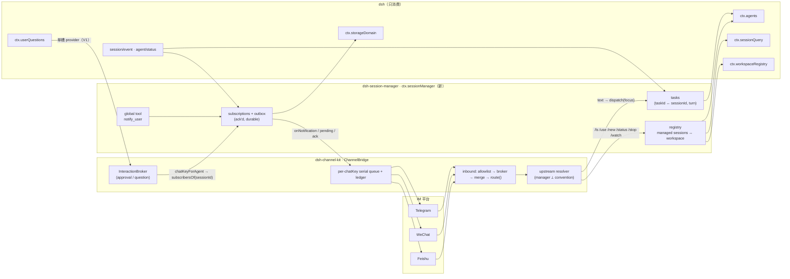
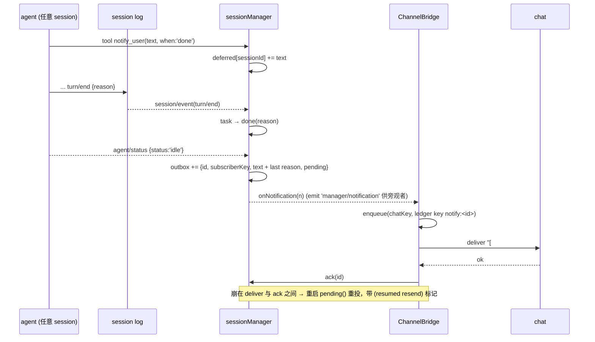

# Session Manager 设计提案

> 状态：**提案（未采纳）** · 2026-08-20 · 基线：`main@7efac9f`，运行时 `~/.dsh/profiles/node_modules/@deepseek-ai/*` 实为 **rc.8**（launcher 仍是 rc.6）
> 上游：`dsh-channel-design.md`（R1–R10）、`docs/dsh-core-reference.md`、`docs/dsh-channel-backlog.md`
> 采纳后的去处：本文 §4–§7 进 design 文档新章节，§9/§10 进 backlog，本文本身不留在树里。

---

## 0. 一句话设计

**把"IM ↔ 一个 agent session"的 1:1 胶水，换成"IM ↔ `ctx.sessionManager` ↔ 本进程内全部 session"。** manager 是一个与渠道无关的 dsh 服务：它登记本进程创建/恢复的每个 session（含所属 workspace/cwd），把"一次派发"建模为**日志可折叠的 task**，把"通知用户"建模为**带 ack 的持久 outbox**，并向 agent 暴露一个全局 `notify_user` 工具。渠道侧 `ChannelBridge` 不再自己 `ensureAgent`，而是把 chat 的现有 `bindings` 当作 **focus 指针**，自由文本发给 focus 的 session，斜杠命令操作 manager，outbox 通知经 bridge **既有的串行队列 + 投递账本** 落到 chat。没有 manager 时 bridge 行为与今天逐字节一致。

三条需求的落点：

| 需求                        | 机制                                                                                                                      | 章节 |
| --------------------------- | ------------------------------------------------------------------------------------------------------------------------- | ---- |
| N1 查询"哪些任务进行到哪了" | `sessionManager.list()/describe()` = `ctx.agents` 实时状态 ⊕ `ctx.sessionQuery` 冷 session ⊕ task 表 ⊕ 投影（title/todo） | §5.2 |
| N2 给 session 派发新任务    | `sessionManager.dispatch()`：resume-before-create 进 manager，task ↔ turn 由 `turn/start`/`turn/end` 折叠                 | §5.3 |
| N3 agent 结束后回调 IM      | `watch` 订阅 + `turn/end` → outbox；agent 侧 `notify_user({text, when:'now'\|'turn-end'})` 工具                           | §7   |

---

## 1. 问题

今天 bridge 的 session 模型（`packages/channel-kit/src/policy/router.ts:22-57`、`bridge/bridge.ts:274-281, 789-825`）：

- chat → session **按 chatKey 推导**（`channel:telegram:<chatKey>`），一个 chat 一个 session；`/new` 只是在 id 后面追加时间戳。
- `cwd` 是**整个 provider 一个全局值**（`config/common.ts:17-31`），没有 per-session 的项目概念。
- bridge 对"我的 session"的全部认知是一张内存 map `sessionChatKeys`（`bridge.ts:871-873`）；没有列表、没有切换、`turn/end` 成功时**什么都不发**（`bridge.ts:896-899` 只在非 `completed` 时发一行）。
- 任何"主动推送"只能走 `ctx.channels.chatKeyOf() + deliver()`，而那条路**绕过**了 bridge 的账本、串行队列和回声抑制。

所以"在 IM 里切 session / 切 project"确实不是 UX 问题，是**模型缺了一层**：没有一个对象知道"本进程有哪些 session、各自属于哪个项目、谁在等谁"。

---

## 2. dsh 已经给了什么、没给什么

调研范围：rc.6 core 类型声明 + `~/.dsh/profiles/node_modules` 下的完整 rc.8 生态（web 宿主、持久化、查询、workspace、jobs、subagent、commands、storage）。

### 2.1 可以直接消费的（manager 不重造）

| 需要                                                             | dsh 已有                                                                                                                                                                                                                                                                | 出处                                                                                                                       |
| ---------------------------------------------------------------- | ----------------------------------------------------------------------------------------------------------------------------------------------------------------------------------------------------------------------------------------------------------------------- | -------------------------------------------------------------------------------------------------------------------------- |
| 跨项目 session 列表（cwd / updatedAt / running / blank / title） | `ctx.sessionQuery.listSessions()` 合并 live+persisted、新→旧；`SessionSummary` 形状（apiproxy `session.list`）可直接照抄                                                                                                                                                | `dsh-session-query/lib/types/index.d.ts:55`；`dsh-host-apiproxy/lib/types/api/sessions.d.ts:173-218`                       |
| "项目"概念                                                       | `ctx.workspaceRegistry`：`list/get/resolveByPath/create`，`Workspace.attachSession(id)` 校验 header.cwd；落盘 `$DSH_HOME/storages/workspace.json`                                                                                                                       | `dsh-workspace/README.md`                                                                                                  |
| 在任意 cwd 按预分配 id create-or-resume                          | `ctx.agents.resume({resumeSessionId}) → 失败再 create({sessionId, meta:{cwd, agentPreset}, setup})`，bridge 今天就是这么做的                                                                                                                                            | `bridge.ts:789-825`；`dsh-core-reference.md §3.1`                                                                          |
| preset 挂载                                                      | `ctx.agentPresets.resolve(id)` 先于创建、`mount(agentCtx, id)` 在 `setup()` 内                                                                                                                                                                                          | `dsh-agent-presets/README.md`                                                                                              |
| 实时状态                                                         | `agent.status` + `agent/status`（`{agent, status}`，scope 过滤）、`session/event`（post-commit emit）；排队数 = `agent.inbox.nextTurn.length + nextStep.length`                                                                                                         | `dsh-agent/lib/types/runtime-types.d.ts:169`、`inbox.d.ts:25-29`                                                           |
| **"做完了"的边沿**                                               | `agent/status → 'idle'` = 整个 agent 静止（含 inbox 里连着开的下一轮、维护任务）；`turn/end {turn, reason}` 只是"这一轮结束"，但携带原因：`completed \| aborted \| blocked \| error \| max-tokens \| interrupted`；`foldConsumedWork(events)` 区分"真做完"和"空转 turn" | `runtime-types.d.ts:163-172`；`dsh-session/lib/types/types.d.ts:135-169, 241`；`dsh-agent/lib/types/consumed-work.d.ts:38` |
| 崩溃痕迹                                                         | `turn/end.reason.kind === 'interrupted'` **只由持久化后端在重载时写入**，loop 永不发出 → 重启后扫到它 = 上个进程死在 turn 中间                                                                                                                                          | `types.d.ts:160-166`                                                                                                       |
| 根监听看全局                                                     | `dsh-scope` 路由"事件向上流、不向下流"：根 ctx 的 `session/event`/`agent/*` 监听器收到所有 agent（含 web UI 开的、子 agent 的）                                                                                                                                         | `dsh-scope/lib/types/index.d.ts:85-96`                                                                                     |
| 关 turn 前的否决钩子                                             | `agent/turn-stopping`（serial，被 await）：监听器 `steer()` 则再跑一步，否则关 turn——"收尾前看看 IM 有没有排队的话"可以用它，但它不是通知钩子                                                                                                                           | `runtime-types.d.ts:284-305`                                                                                               |
| 进度投影                                                         | `ctx.sessionProjections.snapshot(session)`：`title`、todo、`sessionStats`、`subagent`；冷 session 走 `session_projcache.json`                                                                                                                                           | `dsh-session-projection(-cache)`                                                                                           |
| 血缘                                                             | `ctx.sessionQuery.traceSession(id)`、`ctx.subagents.listDescendants(root)`                                                                                                                                                                                              | `dsh-session-query`、`dsh-subagent/README.md`                                                                              |
| 后台作业完成回调                                                 | `ctx.jobs.onJobDone(listener)` —— dsh 里**唯一**现成的"完成即回调"原语                                                                                                                                                                                                  | `dsh-jobs/lib/types/index.d.ts:111`                                                                                        |
| 子 agent 完成通知                                                | settlement notice：子结束 → 给**父 agent** 发一条 `source.kind:'subagent-settled'` 的 user 消息（父不在注册表则丢弃）                                                                                                                                                   | `dsh-subagent/README.md §Settlement delivery`                                                                              |
| 持久 KV                                                          | `ctx.storageDomain` + `defineDomain`（json 后端，原子写，web 组合已挂在 `$DSH_HOME/storages`）                                                                                                                                                                          | `dsh-storage-domain`                                                                                                       |
| 工具分层                                                         | `ctx.tools.register()`：普通插件 ctx = 全局层；`agent.ctx` = 仅该 agent；`defineTool` 必须带 `output.{schema, render}`                                                                                                                                                  | `dsh-tools/README.md`、`lib/types/schema.d.ts:239`                                                                         |
| 命令分层                                                         | `ctx.commands.register()` 同样按 ctx 分全局/agent 层；`command/run`+`command/done` 落日志、不开 turn                                                                                                                                                                    | `dsh-commands/README.md`                                                                                                   |

### 2.2 缺口（manager 必须自己做的、或必须绕开的）

| 缺口                                                    | 事实                                                                                                                                                          | 对设计的含义                                                                                                                                                                                                                  |
| ------------------------------------------------------- | ------------------------------------------------------------------------------------------------------------------------------------------------------------- | ----------------------------------------------------------------------------------------------------------------------------------------------------------------------------------------------------------------------------- |
| **没有 host↔host RPC**                                  | `dsh-api-remotes` 是浏览器↔宿主；`/api` 被 Host-header loopback 围栏挡住且**无认证**                                                                          | manager 只能管理**本进程**的 session。一个 `$DSH_HOME` 一个常驻宿主进程，是唯一被支持的拓扑（backlog §3.1 已拒绝多进程 claim 机制，本设计不推翻）                                                                             |
| **没有通用"turn 结束回调"注册**                         | 最近的只有 `host/session-status(running:false)`（wire 层状态翻转，无载荷）、`agent/status`、`onJobDone`、subagent settlement（面向父 agent，不面向观察者）    | 这正是 manager 要补的那一层：watch 订阅 + outbox                                                                                                                                                                              |
| **`dsh-schedule` 是 session 本地的**                    | ≥300s、session 冷了就不响、不接管已存在的 agent                                                                                                               | v1 不做 cron；"定时派发"是 v2，需要 manager 自己持有定时器                                                                                                                                                                    |
| **`ctx.userQuestions` 是全局单槽**                      | `registerProvider` 写在服务实例字段上，第二次注册抛 `DUPLICATE_PROVIDER`；web 组合里 `dsh-host-apiproxy` 已在根上占槽                                         | **今天 dev-bot 组合下 channel agent 的 `ask_user_question` 发往浏览器而非 Telegram**（bridge 的 per-agent 注册被 `try/catch` 吞掉，`bridge.ts:859-867`）。backlog Q1 就此关闭（答案：全局单槽）；manager 要正面处理，见 §9 V1 |
| `subagents.followup()` 要求"exact live direct parent"   | manager 不是任何 session 的 durable parent                                                                                                                    | manager 派发只能走 `ctx.agents.get(id).followup()/steer()`，不能借 subagent 通道                                                                                                                                              |
| 没有 session 删除/保留 API                              | 持久化 seam 无 delete                                                                                                                                         | `/archive` 只能走 `workspaceRegistry.archiveSession`，不删文件                                                                                                                                                                |
| 没有跨进程写锁                                          | 两个进程 resume 同一 session 会并发追加同一份日志                                                                                                             | 对不是本进程创建的冷 session，派发前要用户确认（§6.3）                                                                                                                                                                        |
| `Agent` 上没有 `meta`                                   | 全树 grep `AgentMeta` 零命中；cwd / parentSession / origin / agentPreset / delegationDepth 全在 `agent.session.header`（`SessionHeader`，`types.d.ts:40-78`） | manager 的登记表以 `header.cwd` 为准；`ctx.sessions.create()` 对非绝对路径 cwd 直接抛                                                                                                                                         |
| `ctx.agents.get(id)` 返回的是**无 disposer 的裸 Agent** | `AgentHandle.dispose` 是能力（capability），只有创建者持有                                                                                                    | manager 必须自己保存 handle（bridge 今天的 `ownedHandles` 搬过去）                                                                                                                                                            |
| `resume` 抛错 ≠ "不在盘上"                              | `resume` 只在 `sessionPersistence.prepare()` 失败时拒绝；bridge 今天用 try/catch 当探针（`bridge.ts:804-821`）                                                | manager 先查 `sessionQuery.listSessions()`（`SessionRecord {header, live, persisted}`）再决定 resume/create，持久化故障不再被误判成"新建"                                                                                     |
| rc.6 ↔ rc.8 漂移                                        | 仓库 devDeps 钉 rc.6，运行时 rc.8；`dsh-agent`/`dsh-session` 的 d.ts 逐字节相同，唯一新增是 rc.8 `assistant/message.interrupted?`                             | 漂移对本设计无害；新包需要的 `dsh-session-query`/`dsh-workspace`/`dsh-tools`/`dsh-storage-domain` 在仓库 `node_modules` 里**没有**，要加 devDeps 或像 `agentPresets` 那样 `ctx.get` 鸭子类型                                  |

---

## 3. 四个关键裁定

**D1 — manager 是 dsh 服务，不是渠道的一部分。** 它依赖 `agents`/`sessions`（必需）、`sessionQuery`/`workspaceRegistry`/`agentPresets`/`storageDomain`/`sessionProjections`（可选、`ctx.get` 降级），**不依赖 `dsh-channel`**。web UI、CLI、任何渠道都能消费它；渠道只是第一个消费者。这和 R3 的依赖方向一致：`dsh-channel-kit` 可选地消费 `ctx.sessionManager`，manager 的 deps 里不出现任何渠道名。

**D2 — 控制面是确定性的命令 + reducer，不是 LLM。** 列表、切换、派发、停止这些操作要可测、零延迟、不花 token；IM 上用斜杠命令 + 编号（Telegram 有 inline keyboard 就用 `OutboundChoice`）。"用自然语言管 session"的 concierge agent 是 v2（§10），而且它的工具就建在同一个 `ctx.sessionManager` API 上——两层不冲突。

**D3 — 通知走 bridge 的队列和账本，不直连 `ctx.channels.deliver()`。** manager 只持有 outbox（持久、带 ack），**不知道 chat 是什么**；bridge 以 `subscriberKey = channel:<id>[:<account>]:<chatKey>` 订阅，拿到通知后用自己的串行队列投递（账本键 `notify:<id>`），成功后 `ack`。崩溃在 deliver 与 ack 之间 → 重启后重投一次，带"(resumed resend)"标记——与投递账本的"诚实 at-least-once"原则同源。

**D4 — 每个 chat 的 `bindings` 就是 focus 指针，没有 binding 时退回今天的约定 id。** 不新增"模式开关"；有 `ctx.sessionManager` 就走 manager 上游，没有就走今天的约定上游。零配置启动时行为与今天一致（单 session 的 id 字节不变）。

---

## 4. 架构



包布局（新增一个包，其余不变）：

```
dsh-channel            契约（不变）
dsh-session-manager    新：ctx.sessionManager（Service）+ notify_user 工具 + 存储 domain   ← 不依赖任何 channel 包
dsh-channel-kit        bridge 新增 manager 上游（可选 ctx.get('sessionManager')）；policy/ 新增 focus-presentation、command-parse reducer
dsh-channel-*          provider：零改动（grep 证实 ensureAgent/session/event/handleCommand 只在 kit 的 bridge.ts 里）
```

---

## 5. `dsh-session-manager` 契约草案

### 5.1 概念

| 概念               | 定义                                                                                                                                                                                                                                                                                                                                    | 持久化                    |
| ------------------ | --------------------------------------------------------------------------------------------------------------------------------------------------------------------------------------------------------------------------------------------------------------------------------------------------------------------------------------- | ------------------------- |
| **ManagedSession** | 本进程 manager 创建或显式接管（`adopt`）的 session：`{sessionId, cwd, workspaceId?, label?, createdBy: subscriberKey, createdAt, adoptedAt?}`                                                                                                                                                                                           | domain 表 `sessions`      |
| **Task**           | 一次派发：`{taskId, sessionId, subscriberKey, mode: 'followup'\|'steer', summary, dispatchedAt, turn?, state, endedAt?, reason?}`；`state ∈ queued → running → done(reason) \| failed \| crashed`，**由该 session 的 `turn/start`/`turn/end` 折叠得出**（`crashed` = reason `interrupted`），表里只存 taskId → (sessionId, turn) 的关联 | domain 表 `tasks`         |
| **Subscription**   | `{subscriberKey, sessionId, kinds: Set<'turn-end'\|'approval'\|'question'\|'notify'\|'error'>}`                                                                                                                                                                                                                                         | domain 表 `subscriptions` |
| **Notification**   | outbox 记录：`{id, subscriberKey, sessionId, kind, text, createdAt, state: 'pending'\|'acked'}`；`id` 单调（`<sessionId>:<seq>` 或 `notify:<uuid>`）                                                                                                                                                                                    | domain 表 `outbox`        |
| **subscriberKey**  | manager 眼里不透明的字符串；渠道约定 `channel:<id>[:<account>]:<chatKey>`，web UI 可以是 `web:<clientId>`                                                                                                                                                                                                                               | —                         |

### 5.2 API

```ts
declare module '@deepseek-ai/cordis' {
  interface Context { sessionManager: SessionManager }
  interface Events {
    'manager/notification'(n: Notification): void                 // emit，观察用（审计/策略插件）
    'manager/task'(t: Task): void                                   // emit，状态迁移
  }
}

class SessionManager extends Service {
  // —— 查询（N1）——
  list(opts?: { workspaceId?: string; includeForeign?: boolean }): Promise<SessionView[]>
  describe(sessionId: SessionId): Promise<SessionDetail>
  workspaces(): WorkspaceView[]

  // —— 派发（N2）——
  create(opts: { cwd?: string; workspaceId?: string; agentPreset?: string;
                 agentOptions?: AgentOptions; label?: string; by: string }): Promise<ManagedSession>
  adopt(sessionId: SessionId, by: string): Promise<ManagedSession>   // 显式接管一个本进程未创建的冷 session
  dispatch(opts: { sessionId: SessionId; message: UserMessage; mode?: 'auto'|'followup'|'steer';
                   by: string; watch?: boolean }): Promise<Task>
  cancel(sessionId: SessionId, cause?: string): Promise<void>

  // —— 订阅与通知（N3）——
  watch(subscriberKey: string, sessionId: SessionId, kinds?: NotificationKind[]): () => void
  unwatch(subscriberKey: string, sessionId?: SessionId): void
  subscribersOf(sessionId: SessionId, kind?: NotificationKind): string[]
  notify(sessionId: SessionId, text: string, opts?: { when?: 'now'|'done'; kind?: 'notify' }): Promise<number>
  onNotification(subscriberPrefix: string, handler: (n: Notification) => void): () => void
  pending(subscriberPrefix: string): Notification[]
  ack(id: string): void
}

interface SessionView {            // 形状对齐 apiproxy SessionSummary，再叠 manager 字段
  sessionId: SessionId; cwd?: string; workspaceId?: string; title?: string
  running: boolean; blank: boolean; updatedAt: number
  managed: boolean                 // 本进程登记过
  foreign: boolean                 // 只在持久化里见过，可能属于别的进程
  activeTask?: Task; pendingInteraction?: 'approval'|'question'
  watchers: number
}
interface SessionDetail extends SessionView {
  tasks: Task[]; todos?: TodoItem[]; stats?: SessionStats
  currentTool?: string; lastAssistantText?: string; lastError?: string
}
```

实现要点：

- `list()` = `ctx.agents.list()`（实时 `status`）⊕ `ctx.sessionQuery.listSessions()`（冷 session，header 级 `cwd/createdAt`）⊕ 本地 `sessions/tasks/subscriptions` 表 ⊕ `sessionProjections.snapshot()`（title/todo，可选）。没有 `sessionQuery` 时只列 managed + live。
- `describe()` 的 `currentTool` 来自最近一次 `tool/call` 且无配对 `tool/result`（bridge 今天已维护 callId→name 映射，`bridge.ts:890-894`，搬进 manager）；`pendingInteraction` 来自 broker/approval 的挂起登记（§6.4）。
- `create()` 复用 bridge 现有的 `ensureAgent` 流程（resume-before-create、`agentPresets.resolve` + `setup` 内 `mount`），**整段搬家**到 manager；workspace 存在则 `attachSession`，失败返回 `workspace-attach-failed` 但 session 已发布（与 apiproxy 同语义）。manager 创建的 session 用随机 id（web 同款），**不再把 chatKey 编进 id**；`channel:<id>:<chatKey>` 语法只保留给每个 chat 的默认 session（D4）。
- `dispatch()` 的 `mode:'auto'` = 今天的 `resolveBusyAction`（`policy/busy.ts`）：idle → followup，running → steer（merge buffer 充当队列）。`followup` 开新 turn → task 独占一个 turn；`steer` 不开 turn → task 标记 `steered`，随当前 turn 一起结束。
- task ↔ turn 关联：派发前记 `{taskId, sessionId, watermarkSeq}`，随后该 session 第一条 `seq > watermark` 的 `turn/start` 即归属 turn，`turn/end(turn)` 关闭。**重启后从日志重放即可重建状态**（R7）；表里存的只是关联，不是真相。
- **通知边沿是 `agent/status → 'idle'`，不是 `turn/end`。** task 的关闭用 `turn/end(turn)`（它带 reason），但"session 做完了"的 `turn-end` 类通知在 idle 边沿发一条，文本附最后一个 `turn/end.reason`——否则一个 followup 接一个 followup 的 session 会每轮推一条。`notify(when:'done')` 同理：写一条 deferred 记录，idle 边沿触发。
- `adopt()`/`create()` 先 `sessionQuery.listSessions()` 查 `{live, persisted}`：`live` → `ctx.agents.get()`；`persisted` → `resume`；都不是 → `create`。`resume` 抛错就是真故障，如实报给用户，不再静默新建。
- `describe().queued` = `agent.inbox.nextTurn.length + nextStep.length`；重启时扫 managed session 的最后一个 `turn/end`，`reason.kind === 'interrupted'` 的标为 `crashed`，`/ls` 里用 `✗` 显示。
- 存储：有 `ctx.storageDomain` 用 `defineDomain('session-manager', …)`（与 web 组合共用 `$DSH_HOME/storages`），没有则退回 kit 的 JSON 文件写法（`createJsonFileStore` 的同款原子写）。四张表都很小，整文件重写即可。

### 5.3 全局工具 `notify_user`

```ts
defineTool({
  name: 'notify_user',
  description: 'Send a short message to the user on their messaging app. when="done" delivers it once this session goes idle, with the outcome attached.',
  parameters: { text: string, when?: 'now' | 'done' },
  output: { schema: { delivered: number }, render: ... },
  execute: ({ text, when }, exec) => manager.notify(exec.agent.id, text, { when }),
})
```

- 由 manager 插件在**普通插件 ctx** 上注册 → 全局层，对所有 agent 可见（含 web UI 开的 session），这正是"main agent 给用户加回调"的落点。
- 目标解析：该 session 的 watchers；**没有 watcher 时落到 `defaultSubscribers`**（配置：用户自己的 DM，如 `channel:telegram:5002186681`），这样在浏览器里开的 session 也能叫到 IM。
- 文本的信任级别等同 assistant 输出（走同一个 allowlist 已过的 chat），不引入新的安全面。
- 待验证：web-app 把全局 `tool-*` 设成 `disabled: true` 是关插件不是关全局层；但 `standard` preset 是否 `restrict()` 了全局工具需要跑一次（§9 V2）。兜底是 manager 在自己 `create()` 的 session `setup()` 里按 agent 再注册一次。

---

## 6. 渠道侧：`ChannelBridge` 的 manager 上游

### 6.1 上游解析（backlog 里那个"第二个 resolver"）

`route()` 今天的约定分支（`router.ts:53-57`）变成 resolver 链的末位，链按 backlog §2.2 的三态约定实现：`null` = 明确拒绝、`undefined` = 无意见、命中带 `provenance`：

1. `approval-reply` / `prompt-reply`（broker，不变）
2. `command`（不变，但命令表扩大，§6.2）
3. **manager-focus**：`store.bindings()[chatKey]` 有值 → `{kind:'dispatch', sessionId, provenance:'focus'}`
4. **convention**：无 binding → 今天的约定 id，`create:true`，`provenance:'convention'`；有 manager 时该 session 也经 `manager.adopt()` 登记，于是它同样出现在 `/ls` 里

bridge 内部：`ensureAgent` → `manager.create/adopt + dispatch`；没有 `ctx.get('sessionManager')` 时走原路径。**protected 面不变**（`handleInbound / mergeMessage / sendOutbound / sendLocal / resolveApproval / resolvePrompt / handleInboundChoice / draftMessageIds / chunkCountBy / showDraft / deleteDraft`），provider 零改动。

### 6.2 命令表（确定性，写成 kit `policy/manager-commands.ts` 纯函数）

| 命令                          | 作用                                                                           | 回复样式                                                                                                                                                                             |
| ----------------------------- | ------------------------------------------------------------------------------ | ------------------------------------------------------------------------------------------------------------------------------------------------------------------------------------ |
| `/ls [ws]`                    | 按 workspace 分组列 session，编号 `1..n`（编号在该 chat 内稳定到下一次 `/ls`） | `▶ 1 dsh-channel · "fix merge window" · running 2m · ⏳approval`<br>`✓ 2 dsh-channel · "docs sync" · done 1h`<br>`✗ 3 dsh-channel · "big refactor" · crashed`<br>`· 4 blog · (blank)` |
| `/use <n\|id>`                | 设 focus（写 `bindings`）；之后自由文本直达该 session                          | `Focused #1 "fix merge window" (dsh-channel)`                                                                                                                                        |
| `/new [ws\|path] [text]`      | `manager.create()` + focus + 可选立即派发                                      |                                                                                                                                                                                      |
| `/to <n> <text>`              | 一次性派发到 n，不改 focus，自动 watch                                         |                                                                                                                                                                                      |
| `/status [n]`                 | `describe()`：running/idle、当前工具、todo、最后一句、挂起的审批/提问          |                                                                                                                                                                                      |
| `/tail [n]`                   | 最后一条 assistant 文本                                                        |                                                                                                                                                                                      |
| `/stop [n]`                   | `cancel()`                                                                     |                                                                                                                                                                                      |
| `/watch <n>` / `/unwatch [n]` | 订阅/退订 turn-end、approval、question、notify                                 |                                                                                                                                                                                      |
| `/ws`                         | 列 workspace                                                                   |                                                                                                                                                                                      |
| `/start /help /bind /status`  | 保留；`/bind <sessionId>` 语义变为 `adopt + focus`（有确认，§6.3）             |                                                                                                                                                                                      |

Telegram 等 `supportsChoices` 平台：`/ls` 附 inline keyboard，回调 `focus:<sessionId>`，与现有 `appr:`/`prompt:` 回调并列。编号与审批的 `#n` 是两个命名空间（审批用 `#n` 回复，session 用 `/use n`），不冲突。

### 6.3 外来（foreign）session 的派发确认

对 `foreign && !managed` 的 session（只在持久化见过、可能被别的 TUI 进程持有），`/use`/`/to` 先回一条确认"this session was not started by this host; resuming it here while another process has it open would corrupt its log — reply `/use n --take` to adopt"。adopt 后登记为 managed，不再问。这是在没有跨进程锁的前提下能做到的最诚实的做法。

### 6.4 出站呈现规则：只流 focus，其他只报结果

一个 chat 同时盯多个 session，若全部流式投递会互相交错。规则（写成 `policy/focus-presentation.ts` 纯函数，输入 `{isFocused, kind}`）：

- **focus 的 session**：与今天完全一致（assistant 文本、工具状态行、draft、typing）。
- **watch 但非 focus 的 session**：不流式；只投 manager 通知（turn-end 摘要 = 最后一条 assistant 文本截断 + reason、`notify_user`、审批/提问请求），每条带徽标前缀 `[#2 docs sync]`。
- **既非 focus 也非 watch**：静默。

审批/提问路由：broker 的 `chatKeyForAgent(agentId)`（`interaction-broker.ts:80-85`）改为 `manager.subscribersOf(sessionId,'approval')` 映射出的本 bridge chat 列表；多个 chat 同时收到，第一个回答者生效（broker 已是单次 resolve）。挂起期间 manager 记 `pendingInteraction`，`/status` 可见——这是远程用户最需要知道的一件事。

### 6.5 恢复

`restore()` 在今天的基础上多一步：`manager.pending(subscriberPrefix)` 取出未 ack 的通知重新入队（账本键 `notify:<id>`，走 `RecoveryPolicy` 的"resumed resend"标记）。focus 指针已在 `bindings` 里持久化，不需要新字段。

---

## 7. 通知管线



通知种类与默认订阅：派发时 `watch:true` 默认订阅全部五种；`/watch` 同理；`defaultSubscribers` 只收 `notify` 与 `error`（避免把浏览器里开的所有 session 的 turn-end 都推到手机上）。

错误反馈：投递返回 `errorKind: 'forbidden'`/chat 级 `not_found` 时 bridge 调 `unwatch(subscriberKey)`——这吸收了 backlog "dead-target registry" 想解决的问题，而不需要一个注册表。

---

## 8. 与 R1–R10 / backlog 的对账

| 约束         | 本设计                                                                                                                |
| ------------ | --------------------------------------------------------------------------------------------------------------------- |
| R1 可逆      | manager 的 `register`/`watch`/`onNotification`/工具注册全在 `ctx.effect` 里；卸载即撤                                 |
| R2 inject    | manager：`inject = ['agents','sessions']`，其余 `ctx.get` 降级；kit 的 `inject` 不变，`sessionManager` 是可选消费     |
| R3 依赖方向  | manager 不依赖任何 channel 包；kit peer-dep `dsh-session-manager`（可选）；provider 不出现在任何人 deps               |
| R4 契约      | 新事件 `manager/notification`、`manager/task` 仅 emit，策略插件纯监听                                                 |
| R5 形状      | `SessionManager extends Service`（core 式单例，同 `ChannelRegistry`）                                                 |
| R6 能力事实  | `Channel` 抽象类**零改动**（A5 继续成立）                                                                             |
| R7 日志纪律  | task 状态由 `turn/start`/`turn/end` 折叠；manager 表只存关联；通知用 outbox 而非内存                                  |
| R8 waterfall | approval answerer 仍"不是我的 → `next()`、超时 → `next()`"，只是"我的"的定义从 `sessionChatKeys` 变成 `subscribersOf` |
| R9 YAML      | profile 多一行 `dsh-session-manager`，见 §10                                                                          |
| R10 scope    | `notify_user` 在插件 ctx（全局层）注册；per-agent 兜底在 `setup(agentCtx)`                                            |

backlog 变化：Q1 **关闭**（全局单槽，见 §2.2）→ 新开 V1；§2.2 "route() resolver 三态 + provenance" **触发**（第二个 resolver 到了）；§3.1 "多进程 claim 机制"维持拒绝，但触发条件改写为"`dsh-api-remotes` 提供带认证的 host↔host 通道"；"dead-target registry" 由 §7 的 `forbidden → unwatch` 覆盖。

---

## 9. 必须先验证的（按风险排序）

| #   | 问题                                                                                                                                                                                                                                          | 怎么验                                                                                                                     | 不成立时的退路                                                                                                                                                                                                      |
| --- | --------------------------------------------------------------------------------------------------------------------------------------------------------------------------------------------------------------------------------------------- | -------------------------------------------------------------------------------------------------------------------------- | ------------------------------------------------------------------------------------------------------------------------------------------------------------------------------------------------------------------- |
| V1  | **`userQuestions` 单槽被 apiproxy 占住**，manager 如何成为 IM 的提问入口？候选：在 `setup(agentCtx)` 里 `agentCtx.isolate('userQuestions')` + `provide` 一个路由 provider，让 `ask_user_question` 在该 agent scope 解析到 manager 的 provider | 在 dev-bot profile 上跑一个 spike：channel 创建的 session 调 `ask_user_question`，看问题落在 Telegram 还是浏览器           | 退到 `dsh-channel-host` profile（不装 apiproxy/webserver/UI，只装 session 侧那几行：persistence、query、workspace、storage、projection、title、presets），manager 成为唯一 provider；代价是失去浏览器作为第二控制台 |
| V2  | 全局层 `ctx.tools.register` 的 `notify_user` 在 `standard` preset 下是否可见                                                                                                                                                                  | 创建一个 preset session，看 `request/header.tools` 里有没有 `notify_user`                                                  | `setup()` 里 per-agent 再注册一次（manager 自建 session 一定可见；web UI 开的 session 不可见）                                                                                                                      |
| V3  | 根 ctx 监听 `session/event`/`agent/status` 是否收到所有 session                                                                                                                                                                               | `dsh-scope` 文档已写明"事件向上流"（`index.d.ts:85-96`），风险低；M15 里留一个"web UI 创建的 session 也出现在 `/ls`"的 e2e | 改监听 `agent/created` 后逐 agent 在 `agent.ctx` 上挂监听                                                                                                                                                           |
| V4  | `workspaceRegistry.attachSession` 对 manager 创建的随机 id 与 cwd 的校验路径；以及 cwd 规范化有损（不同 cwd 可能共享目录）                                                                                                                    | 单测 + 实测一个 `/new /other/path`                                                                                         | 先不 attach（"Ungrouped"），只记 cwd                                                                                                                                                                                |
| V5  | rc.8 上 `ctx.agents.resume` 对"别的进程正持有"的 session 是否有任何检测                                                                                                                                                                       | 读 rc.8 `dsh-session-persistence` 的 `prepare()`                                                                           | 没有 → §6.3 的确认流程是最终答案                                                                                                                                                                                    |

---

## 10. 里程碑

| 里程碑               | 交付                                                                                                                                                                                                              | 验收                                                                   |
| -------------------- | ----------------------------------------------------------------------------------------------------------------------------------------------------------------------------------------------------------------- | ---------------------------------------------------------------------- |
| **M15 manager 核心** | 新包 `dsh-session-manager`：registry、`list/describe`、`create/adopt/dispatch/cancel`、task 折叠、domain 存储；`ensureAgent` 从 bridge 搬入；内存 fake 的 `node:test` 套件                                        | 现有 kit/provider 全部测试不变地通过（bridge 在无 manager 时行为相同） |
| **M16 渠道上游**     | resolver 链三态 + provenance；focus=bindings；命令表；`focus-presentation` 规则；broker 改 `subscribersOf`；Telegram inline keyboard `focus:` 回调                                                                | conformance 套件零改动；新增命令/呈现 reducer 测试                     |
| **M17 通知**         | 订阅、outbox/ack、`turn/end` 摘要、`notify_user` 工具、恢复期重投、`forbidden → unwatch`                                                                                                                          | 崩溃-重启 e2e：通知恰好一次或带标记两次，绝不丢                        |
| **M18 组合与 spike** | V1–V5；`dsh-channel-host` profile（若 V1 需要）；README 双语 + design §14 + backlog 更新                                                                                                                          | dev-bot 上跑通：浏览器开 session → `notify_user` → Telegram 收到       |
| v2（有触发才做）     | concierge agent（自然语言控制，工具建在 `ctx.sessionManager` 上；触发：命令超过 ~10 条或用户持续用自由文本问状态）；定时派发（manager 自持定时器，触发：用户要 cron）；`onJobDone` 接入（触发：后台作业成为常态） |                                                                        |

---

## 11. 明确不做的

- **不做跨宿主联邦**（manager 管别的机器/进程的 session）。没有 host↔host RPC、没有认证；backlog §3.1 的拒绝理由依然成立。触发条件已改写（§8）。
- **不把 manager 塞进 `dsh-channel` 契约**。契约是"渠道长什么样"，manager 是"session 怎么管"，混在一起会让 A5（加平台不改契约）和 D1（web 也能用 manager）同时失效。
- **不在 bridge 里加"模式开关"配置**。有没有 manager 由 `ctx.get` 决定（D4），配置项只会制造两份要维护的路径。
- **不用 LLM 做控制面的 v1**。见 D2。
- **不给每个 chat 一个"manager 会话日志"**。manager 的命令往返不进任何 session log（与 `ctx.commands` 的 `command/run` 不开 turn 同理）；需要审计的走 `manager/task`、`manager/notification` 事件。
