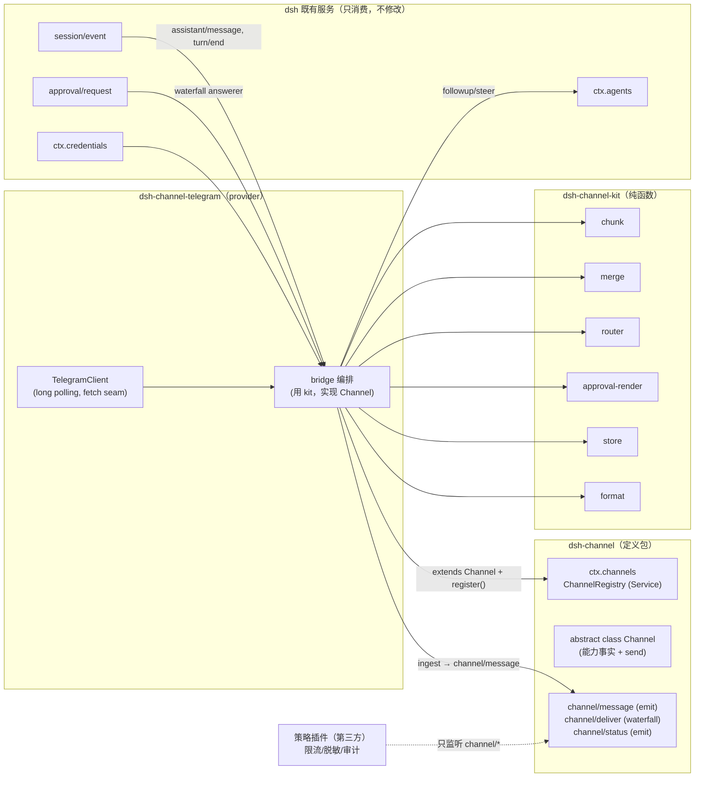

# dsh-channel 设计与技术文档

> 版本：v0.1 草案 · 日期：2026-08-14
> 上游：[dsh-channel-handoff.md](./dsh-channel-handoff.md)（目标、边界、R1–R10 硬约束、验收标准以该文档为准）
> 调研基线：deepseek-harness@47f9438、LoserFox/telegram、BiBoyang/dsh-im-bridge、Jesse-njx/dsh-chatnode-wechat、nowledge-mem、NousResearch/hermes-agent、openclaw/openclaw（均为 2026-08-14 主分支快照）

---

## 0. 一句话设计

**`ctx.channels` 是一个照抄 `LlmRuntime` 形状的注册表 core；`Channel` 是照抄 `LlmAdapter` 形状的普通抽象类 seam；六件脏活是不碰 IO 的纯函数库；入站消息以可归并的 `source.kind: 'channel'` 落进 session log，幂等从日志折叠推导；审批是 `approval/request` waterfall 上一个"只答自己 agent、超时必 `next()`、绝不默认放行"的 answerer。**

三包结构与职责边界不变（见 handoff §0）：

| 包 | 一句话 | npm 名（建议） |
|---|---|---|
| `dsh-channel` | 契约：`declare module` + `abstract class Channel` + `channel/*` 事件 + 消息类型。零实现 | `dsh-channel` |
| `dsh-channel-kit` | 六件脏活的纯函数 + `ChannelStore` 接口与 JSON 文件实现 | `dsh-channel-kit` |
| `dsh-channel-telegram` | 第一个 provider，验证抽象 | `dsh-channel-telegram` |

---

## 1. 调研结论（决定设计的那部分）

### 1.1 dsh 源码给出的形状答案

| 问题 | 答案 | 出处 |
|---|---|---|
| 一对多注册表长什么样 | `LlmRuntime extends Service`（具体类，`ctx.llm`）+ `registerAdapter(providers, adapter)` 返回带 `dispose` 的 handle；**adapter 是普通抽象类，不是 Service** | `packages/llm/llm/src/index.ts` |
| 定义包长什么样 | 一个文件里放齐：`declare module`（Context + Events）、抽象类（能力事实用 `get` 保守默认值）、类型导出 | `packages/fs/fs/src/index.ts` |
| 纯事件旁路怎么写 | 不提供服务，只 `ctx.on('fs/*')`，每个 `apply()` 一份状态、disposer 归零 | `packages/fs/fs-observation-policy/src/index.ts` |
| 依赖方向 | 跨 dsh 包一律 `peerDependencies`（+ devDeps 供测试），`dependencies` 只留第三方 | `packages/fs/tool-fs/package.json` |
| 可选依赖降级 | `import type {} from '...'` + `ctx.get('approval')`，缺失→deny，注释写明"historical degrade to deny" | `packages/core/tools/src/index.ts:1678` |

**设计裁定：`Channel` 不继承 `Service`。** handoff R6 的示意代码写了 `extends Service`，但 R5 同时指明"对照 LlmRuntime + 多个 adapter，形状一致"——而 `LlmAdapter` 正是普通抽象类。一个 Service 独占一个 ctx key，多平台并存时没有第二个 key 可占；provider 的生命周期由它自己的插件 fiber 承载，注册项由 `ctx.channels.register()` 返回的 disposer 回收。这与 R1/R5 一致，且少一层 Cordis 代理。

### 1.2 待核实 API：已全部核实

| handoff §2 待核实项 | 核实结果 |
|---|---|
| `ctx.agents` 创建/投递/输出 | `ctx.agents.create({ sessionId, meta: { cwd, agentPreset… }, agentOptions: { provider, model }, setup? })` → `AgentHandle { agent, dispose }`；`ctx.agents.resume({ resumeSessionId, … })` 恢复持久化会话（依赖 `sessionPersistence`）；`ctx.agents.get(id)` 返回裸 `Agent`。投递入站：`agent.followup(msg)`（独立新 turn 并唤醒）/ `agent.steer(msg)`（插话，最近 step 边界消费）/ `agent.inject(msg)`（注入上下文，不唤醒）。输出没有回调 API——**从 `session/event` 流上读** `assistant/message` / `turn/end`。`agent.status`（`idle`/`running`）与 `agent/status` 事件可驱动 typing 指示。 |
| `session/event` schema | `(session: Session, event: SessionEvent)`，emit 模式、post-commit、fire-and-forget；`SessionEvent = { type, seq, time, data, ignorable? }`。`SessionEventMap` 通过 `declare module '@deepseek-ai/dsh-session/types'` 归并扩展（user-approval 的 `approval/asked`/`approval/decided` 是现成范例）。注意：**裸事件夹在 turn 之外，reload 时视作 crash tail 被丢弃**——想扩展日志事件必须包在开启的 turn 内（见 §4.5 store 的取舍）。 |
| `approval/request` 签名与超时 | waterfall：`(req: ApprovalRequest, next) => Promise<ApprovalOutcome>`；`req = { agent, toolName, callId?, reason?, signal? }`；outcome ∈ `'allowed-once' | 'rejected' | 'cancelled' | 'unavailable'`，无 answerer / answerer 抛错 → `'unavailable'`（fail-closed）；`signal` abort → `'cancelled'`，迟到的回答被丢弃。会话策略 `'never'` 在 dispatch 之前就地拒绝。审计对（asked/decided）由 `ApprovalService` 落日志，answerer 无需管。 |
| `ctx.sessions.fork(source, boundary?, childSessionId?)` | 只能在完成的 turn 边界处 fork 前缀（`OPEN_TURN` 拒绝）；渠道场景对应 `/fork` 类命令，**v1 不做**，接口预留即可。 |
| `ctx.credentials` | `ctx.credentials.resolve(credentialRef('TELEGRAM_BOT_TOKEN'))` → `{ value, source } | undefined`；**每次操作重解析、禁止跨操作缓存**（改凭据不需重启）。chatnode-wechat 的 `bootWithCredentials` 是现成用法范例。 |
| Telegram Bot API | 文本上限 **4096** 字符/条（caption 1024）；`getUpdates` 长轮询与 `setWebhook` 互斥，v1 用长轮询（无公网依赖、参考实现一致）；富文本用 **HTML parse mode**（MarkdownV2 需转义 `_*[]()~`>#+-=|{}.!` 十八个字符，脆；两家参考实现都选 HTML+纯文本回退）；审批可用 **inline keyboard**（`callback_data` ≤64 字节，回调后须 `answerCallbackQuery` 消除转圈）；`editMessageText` 支持草稿式流式（v2）；速率约 30 msg/s 全局、约 1 msg/s 每 chat（群 20/min），出站需节流。 |

### 1.3 三个既有实现：收敛与教训

| | LoserFox/telegram | BiBoyang/dsh-im-bridge | Jesse-njx/dsh-chatnode-wechat |
|---|---|---|---|
| 会话路由 | 每 chat 一 session（`telegram:<chatId>`），**内存 Map，重启即失联** | 单用户绑定单 session（`/bind`），跟随最近活跃 | 单 peer 驱动"活动会话"（`/use` `/new` 切换） |
| merge | 无 | 去抖窗口 + `..`/`!!` 控制后缀 + 崩溃恢复快照 | 无 |
| chunk | 换行/句号优先断点 | 码点计数 + `（i/n）`前缀递归收敛 | markdown 块切分保代码围栏 + 贪心装箱（源自 hermes） |
| approval | 无 | 文本"批准/拒绝"+ 单 pending broker，超时 `next()` 委托 | 编号 `#n` + `/yes` `/no`，超时默认 deny，只答自己 agent |
| store | 无（全内存） | JSON 原子写：seenIds 环、context_token、绑定、merge 快照 | 网关内去重 TTL |
| format | Markdown→Telegram HTML 子集，失败回退纯文本 | 无 | markdown 规范化 |
| 服务抽象 | 无 | 无 | **唯一做了服务分层的**：`ctx.wechat` gateway + `wechat/message` 事件 + node 消费层 |

三家各自为战却收敛出同一组文件名——证明六件脏活是问题固有形状（handoff §3 判断成立）。共同缺陷：**没有一家从 session log 推导幂等**（都是自建状态），没有一家表达能力事实（chunk 长度、按钮有无全部硬编码）。chatnode 的 gateway/node 分界与"allowlist 是安全边界、必填无默认"的立场直接采纳。

### 1.4 hermes-agent 与 openclaw：成熟 gateway 的可搬结论

**hermes**（`gateway/platforms/base.py` 7322 行，25+ 平台）：

- **必选 adapter 面极小**：`connect / disconnect / send / send_typing / send_image / get_chat_info`，其余（文件、语音、clarify 按钮、审批按钮、model picker）全部**基类给降级默认，平台按能力覆盖**——与 R6 完全同构，且证明了这套面在 25 个平台上没有分叉。
- **反面教材**：其"内建路径"清单要求每接一个平台改 **16 处核心代码**（enum、factory、授权表、cron 表、tool 路由、status、wizard……）。这正是 dsh-channel 存在的理由：注册表 + 事件让这 16 处塌缩为 1 个插件。
- **平台提示进 system prompt**（`PLATFORM_HINTS`）：不告诉模型自己在哪个平台，它就会在不渲染 markdown 的平台上输出 markdown。→ 采纳为 kit 的 `promptHint()`（§4.7）。
- **delivery ledger**（`gateway/delivery_ledger.py`）："生成了但未确认送达"的最终回复是唯一会无痕丢失的产物。`pending → attempting → delivered/failed/abandoned` 状态机；`attempting` 崩溃后重投必须带"恢复重发"可见标记——**诚实的 at-least-once，绝不静默重复**。→ 采纳为 store 的 deliveries 表（§4.5）。
- 工程惯例：自消息过滤防回环、日志脱敏平台标识符、指数退避 + 抖动重连、`MAX_MESSAGE_LENGTH` 常量化。

**openclaw**（`src/channels/`，29 渠道，channel 即插件）：

- **`ChannelPlugin` = `id + meta + capabilities` 必填，其余全部可选 adapter 槽位**——again，能力事实 + 优雅降级。`capabilities` 是静态事实表：`chatTypes / reactions / edit / threads / media / blockStreaming / nativeCommands`。
- **debounce 三条铁律**（`inbound-debounce-policy.ts`）：带媒体的消息**不合并**（附件元数据会与文本批脱钩）；控制命令（stop/status）**不延迟**；空文本不合并。→ 直接写进 merge 模块的契约（§4.2）。
- **流式四模式**：`off | partial | block | progress`。progress 模式的门控值得抄：**定时器触发才创建草稿消息，快回答根本不发草稿**。v1 只做 `off`（终态投递）+ 可选 progress 心跳，`block`（编辑草稿）留给 v2 的 `supportsEdit` 平台。
- 边界纪律：核心渠道代码不许被插件直接 import，扩展面走 SDK 契约——对应我们的"消费方只依赖 `dsh-channel`"（R3）。

---

## 2. 总体架构



数据流两条：

- **入站**：平台消息 → provider 去重（store+日志折叠）→ `ctx.channels.ingest()` 发出 `channel/message` → provider 自己（或未来的通用 consumer）经 merge/router → `agent.followup()` → 成为 `user/message`（`source.kind: 'channel'`，携带平台消息 id）落日志。
- **出站**：`session/event` 上读到 `assistant/message` / `turn/end` → 组装 `OutboundMessage` → `ctx.channels.deliver()` 走 `channel/deliver` waterfall（策略插件在此拦截）→ 落 delivery ledger → `Channel.send()` 分段发送 → 标记 delivered。

**为什么 provider 既发出又消费 `channel/message`？** 事件不是给自己用的——它是策略扩展点（R4：限流、脱敏、审计插件只监听事件就能工作）与未来"通用 consumer 插件"的接缝。v1 里 provider 自己闭环，事件照发；第二平台验证时若出现可共享的 consumer 逻辑，可平移进独立插件而不改契约。

---

## 3. `dsh-channel` 定义包

### 3.1 契约（完整 declare module）

```ts
// packages/channel/src/index.ts —— 全部契约在一个 declare 块，定义包独占（R4）
import { Context, Service } from '@deepseek-ai/cordis'

declare module '@deepseek-ai/cordis' {
  interface Context {
    channels: ChannelRegistry
  }
  interface Events {
    /**
     * 一条归一化的入站消息已被某 provider 接收（去重后）。
     * 观察性事件：策略插件在此做审计/统计；不承载路由决定。
     * @mode emit
     */
    'channel/message'(msg: InboundMessage): void
    /**
     * 一次出站投递。策略插件可包装（改写文本、限流延迟）或
     * 短路（返回 suppressed receipt 拦下消息）；纯观察者必须调 next()。
     * innermost 默认值 = 注册表定位 Channel 并调用其 send。
     * @mode waterfall
     */
    'channel/deliver'(out: OutboundMessage, next: () => Promise<DeliveryReceipt>): Promise<DeliveryReceipt>
    /**
     * provider 连接状态变化（connecting/connected/disconnected/fatal）。
     * @mode emit
     */
    'channel/status'(channelId: string, status: ChannelStatus, error?: Error): void
  }
}

// 入站消息带平台身份进入 session log —— 幂等的锚点（R7）
declare module '@deepseek-ai/dsh-llm' {
  interface MessageSourceMap {
    channel: {
      kind: 'channel'
      /** provider id，如 'telegram' */
      channel: string
      /** 平台会话键（私聊=chat id，群=chat id；含义由 provider 定义，稳定即可） */
      chatKey: string
      /** 发送者平台 id */
      senderId: string
      /** 组成这条 user/message 的平台消息 id（merge 合并后可多条） */
      messageIds: string[]
    }
  }
}
```

`MessageSourceMap` 归并是整个设计的支点：入站消息一旦被 agent 认领，**平台消息 id 就随 `user/message` 事件成为持久事实**。重启后 provider 折叠日志即可重建"哪些平台消息已处理"，不需要影子会话状态（R7、跑偏信号 5）。

### 3.2 消息类型

```ts
/** 平台无关的入站消息。media 在 v1 只保留占位描述，不下载。 */
export interface InboundMessage {
  readonly channel: string          // provider id
  readonly chatKey: string          // 稳定会话键
  readonly senderId: string
  readonly senderName?: string
  readonly messageId: string        // 平台消息 id（去重键）
  readonly chatType: ChatType       // 'direct' | 'group' | 'thread'
  readonly text: string
  readonly timestamp: number        // epoch ms
  /** v1 不处理媒体，但把事实带上，让 merge 知道"不可合并" */
  readonly hasMedia: boolean
  /** 群聊中是否 @ 了机器人（provider 判定；v1 群聊不路由，仅记录） */
  readonly mentionsBot?: boolean
}

/** 出站消息：语义内容 + 呈现意图，分段/转义是 provider 的事 */
export interface OutboundMessage {
  readonly channel: string
  readonly chatKey: string
  /** markdown 源文本；provider 按自身 formatTier 降级渲染 */
  readonly markdown: string
  /** 结构化选项（审批/澄清）；无按钮平台由消费方预先降级为编号文本 */
  readonly choices?: readonly OutboundChoice[]
  /** 幂等键：同 key 的重复 deliver 应被 ledger 挡下 */
  readonly deliveryKey: string
  /** 溯源（审计用）：来自哪个 session 的哪个事件 */
  readonly origin?: { sessionId: string; seq?: number }
}

export interface OutboundChoice { readonly id: string; readonly label: string }

export interface DeliveryReceipt {
  readonly status: 'sent' | 'suppressed' | 'failed'
  /** 平台侧消息 id（分段则为多条） */
  readonly platformMessageIds?: readonly string[]
  readonly error?: string
}

export type ChatType = 'direct' | 'group' | 'thread'
export type ChannelStatus = 'connecting' | 'connected' | 'disconnected' | 'fatal'
```

### 3.3 `Channel` 抽象类（seam）

```ts
/**
 * 平台 provider 的抽象基类。普通抽象类而非 Service（对齐 LlmAdapter）：
 * 生命周期由 provider 插件自己的 fiber 承载，注册经 ctx.channels.register()。
 * 必选面故意极小（hermes 用 6 个方法接了 25 个平台）；
 * 能力差异一律走"能力事实 + 降级"，禁止加只有单平台能实现的方法（R6）。
 */
export abstract class Channel {
  /** 稳定 provider id（'telegram'、'discord'…），注册表键 */
  abstract readonly id: string

  // ---- 能力事实：基类保守默认，实现覆盖（照抄 FileSystem.sandboxMode 写法） ----
  /** 单条消息最大字符数；undefined = 无已知上限 */
  get maxMessageChars(): number | undefined { return undefined }
  /** 富文本档位：消费方据此选择 format 降级路径 */
  get formatTier(): 'plain' | 'markdown' | 'html' { return 'plain' }
  /** 是否支持结构化选项（按钮/卡片）；false 时审批降级为编号回复 */
  get supportsChoices(): boolean { return false }
  /** 是否支持编辑已发消息（草稿式流式的前提，v2） */
  get supportsEdit(): boolean { return false }
  /** 是否支持 typing 指示 */
  get supportsTyping(): boolean { return false }
  /** 支持的会话形态 */
  get chatTypes(): readonly ChatType[] { return ['direct'] }

  // ---- 必选行为 ----
  /**
   * 发送一段已按平台约束渲染好的文本（可选附带 choices）。
   * 分段由调用方完成；实现只负责单条上行与错误报告。
   */
  abstract send(chatKey: string, text: string, opts?: {
    choices?: readonly OutboundChoice[]
    signal?: AbortSignal
  }): Promise<{ platformMessageId: string }>

  // ---- 可选行为：默认无害降级 ----
  /** typing 指示；默认 no-op */
  async sendTyping(_chatKey: string): Promise<void> {}
}
```

### 3.4 `ChannelRegistry`（core）

```ts
export class ChannelRegistry extends Service {
  private entries = new Map<string, Channel>()

  constructor(ctx: Context) { super(ctx, 'channels') }

  /**
   * 注册一个 provider。重复 id 抛错（对齐 LlmRuntime 的 DUPLICATE 语义）。
   * 经 ctx.effect 返回 disposer：provider 卸载时注册自动回收（R1）。
   */
  register(channel: Channel): () => void {
    return this.ctx.effect(() => {
      if (this.entries.has(channel.id)) {
        throw new Error(`channel "${channel.id}" is already registered`)
      }
      this.entries.set(channel.id, channel)
      return () => { this.entries.delete(channel.id) }
    }, 'channels.register()')
  }

  get(id: string): Channel | undefined { return this.entries.get(id) }
  list(): Channel[] { return [...this.entries.values()] }

  /** provider 收到去重后的入站消息时调用：归一化断言 + 广播 */
  ingest(msg: InboundMessage): void {
    this.ctx.emit('channel/message', msg)
  }

  /**
   * 出站统一入口：走 channel/deliver waterfall，innermost 默认值定位
   * provider 并 send。策略插件（限流/脱敏/审计）在 waterfall 上包装或短路。
   */
  async deliver(out: OutboundMessage): Promise<DeliveryReceipt> {
    return this.ctx.waterfall('channel/deliver', out, async (): Promise<DeliveryReceipt> => {
      const channel = this.entries.get(out.channel)
      if (channel === undefined) return { status: 'failed', error: `no channel "${out.channel}"` }
      // 分段渲染在消费侧完成后单条进来，或此处调 kit（见 §5 编排选择）
      const result = await channel.send(out.chatKey, out.markdown, { choices: out.choices })
      return { status: 'sent', platformMessageIds: [result.platformMessageId] }
    })
  }
}
```

策略类扩展的验收（R4）：一个"审计插件"只 `ctx.on('channel/message')` + `ctx.on('channel/deliver', (out, next) => next())` 即可完整工作，不 import 任何 provider、不实现 `Channel`——与 `fs-observation-policy` 同构。

### 3.5 定义包 package.json 要点

```jsonc
{
  "name": "dsh-channel",
  "peerDependencies": {
    "@deepseek-ai/cordis": ">=…",
    "@deepseek-ai/dsh-llm": ">=…"        // MessageSourceMap 归并 + UserMessage 类型
  },
  "keywords": ["dsh", "dsh-plugin"]
}
```

peerDeps **收窄版本范围**（dsh 是 developer preview，见 handoff §6 风险）。定义包不依赖 `dsh-session` / `dsh-agent`——契约里只出现自己的类型与 `dsh-llm` 的 source 归并；`grep dsh-channel-telegram` 在本包必须零命中（A2）。

---

## 4. `dsh-channel-kit` 六件脏活

**总原则**：每个模块是"输入 → 输出、无 IO、无定时器、无全局态"的纯函数；时间以参数传入，定时器与文件系统被隔离在两个明确标注的非纯文件（`store/json-file.ts`、`runtime/timers.ts`）里。kit 不 import cordis——不用 dsh 的人也能拿去接自己的 bot（handoff：文档和模板比功能更重要）。

### 4.1 chunk —— 长回复怎么切

```ts
export interface ChunkOptions {
  maxChars: number                     // 来自 Channel.maxMessageChars
  numbering?: 'none' | 'prefix'        // '（i/n）' 前缀；默认 none
  countBy?: 'codepoint' | 'utf16'      // 微信按码点，Telegram 按 UTF-16；默认 codepoint
}
export function chunkText(markdown: string, opts: ChunkOptions): string[]
```

算法（合并三家实现的优点）：

1. **按 markdown 块切分**，围栏代码块视为原子（chatnode 的 `splitMarkdownBlocks`）——不切断代码块与链接（handoff §3 硬要求）；
2. 贪心装箱到 `maxChars`（chatnode `packBlocks`）；
3. 超长的单一原子块退化为硬切，但**代码块硬切时补围栏**（切口处补 ``` 收尾/重开，保持每段可渲染）；
4. `numbering: 'prefix'` 时套用 im-bridge 的前缀宽度递归收敛（前缀占预算，段数与前缀宽互相影响，5 轮收敛，失败退无前缀）；
5. 纯文本段内优先在换行/`。`/`. ` 断（LoserFox 的断点偏好）。

流式取舍：**v1 只做终态投递**（`assistant/message` 事件级，即 openclaw 的 `off`/`block` 边界）——平台速率限制 + 多数平台无编辑能力，逐 token 出站不成立；长任务的感知延迟由 progress 心跳（§5.4）补偿。`supportsEdit` 平台的草稿流式（openclaw `block` 模式 + "定时器触发才建草稿"门控）列入 v2。

### 4.2 merge —— 连发合并

纯函数化的关键：**reducer 只算状态与动作，定时器在外面**。

```ts
export interface MergeState { readonly buffer: readonly string[]; readonly deadline: number | undefined }
export type MergeInput =
  | { kind: 'message'; text: string; hasMedia: boolean; isCommand: boolean; now: number }
  | { kind: 'tick'; now: number }          // 定时器/轮询边沿喂进来
export type MergeEffect =
  | { kind: 'flush'; text: string }        // 合并文本交付路由
  | { kind: 'ack-long' }                   // 超长输入先回"收到，处理中"
  | { kind: 'armTimer'; at: number }       // 请求外部在 at 时刻喂一次 tick
export function mergeReduce(state: MergeState, input: MergeInput, opts: MergeOptions): { state: MergeState; effects: MergeEffect[] }
```

契约（吸收 openclaw 三铁律 + im-bridge 控制后缀）：

- `isCommand`（`/` 开头或审批应答词）**永不入缓冲，立即旁路**——stop/审批不能被去抖延迟；
- `hasMedia` 的消息**立即 flush 当前缓冲并单独交付**——附件不与文本批合并；
- `..` 后缀 = 继续等（重置窗口）；`!!` 后缀 = 立即 flush；裸后缀忽略（im-bridge 语义，可配置关闭）；
- 默认窗口 5s；缓冲以 `\n` join；
- **agent 思考中插话**：merge 不管——flush 后由消费方按 agent 状态选投递方式：`idle → followup`，`running → steer`（dsh 的 inbox 语义天然回答了 handoff 的这个问号）。

崩溃恢复：每次 buffer 变化产出快照（消费方写入 store 的 `mergeBuffers`），启动时 `restore` 后当作刚到达重新起窗（im-bridge 方案）。

### 4.3 router —— 平台会话 → dsh session

```ts
export interface RouteContext {
  readonly channel: string
  readonly boundSessions: Readonly<Record<string, string>>   // chatKey → sessionId（store.bindings）
  readonly liveSessionIds: readonly string[]                  // ctx.agents.list() 投影
}
export type RouteDecision =
  | { kind: 'command'; command: string; args: string }        // /开头，本地处理
  | { kind: 'approval-reply'; raw: string }                   // 交给 approval-render.parse
  | { kind: 'route'; sessionId: string; create: boolean }     // 投递目标
  | { kind: 'drop'; reason: 'group-unsupported' | 'empty' }
export function route(msg: { chatKey; text; chatType; mentionsBot? }, ctx: RouteContext, opts: RouterOptions): RouteDecision
```

- **默认策略：每 chat 一会话**，sessionId 约定 `channel:<channelId>:<chatKey>`（LoserFox 模式，可从 id 反解归属）；`/new` 轮换为 `channel:<channelId>:<chatKey>:<ts>` 并更新 binding。
- **续接优先于新建**：目标 sessionId 不在 live 列表时，消费方先试 `ctx.agents.resume({ resumeSessionId })`（部署了 persistence 时重启不丢上下文，A4 的另一半），失败再 `create`。router 只给决定，agents 调用留在消费方。
- 群聊：v1 `chatType !== 'direct'` → `drop`（chatnode 立场：iLink 群语义不清 + 提示注入面大）；`mentionsBot` 事实已在类型里，v2 开群聊不动契约。
- 多设备同一用户：天然收敛——路由键是 chat 不是设备。

### 4.4 approval-render —— 无按钮渠道的审批表达

```ts
export interface PendingApproval { readonly num: number; readonly requestId: string; readonly toolName: string; readonly expiresAt: number }
export function renderApproval(req: { toolName; reason?; num: number }, caps: { supportsChoices: boolean }, opts): 
  { kind: 'choices'; text: string; choices: OutboundChoice[] }   // choices: [{id:'appr:<num>:1','批准'},{id:'appr:<num>:0','拒绝'}]
| { kind: 'text'; text: string }                                  // "回复 1 批准 / 2 拒绝"
export function parseApprovalReply(input: { text?: string; choiceId?: string }, pending: readonly PendingApproval[]):
  { kind: 'answer'; num: number; outcome: 'allowed-once' | 'rejected' } | { kind: 'not-an-answer' }
```

消费方的 answerer 编排契约（不是纯函数的部分，写死在文档与模板里）：

1. **只答自己的 agent**：`req.agent.session.id` 不是本渠道路由的会话 → 立刻 `return next()`（chatnode 的 `ownsAgent` 纪律，避免抢走 web UI 的审批）；
2. **先展示后等待**：提问先发出去，用户看不见就无从回答；
3. 编号并发：多 pending 用 `#n` 区分；裸 `1`/`2` 仅在恰有一条 pending 时有效（chatnode 语义）；
4. **超时 → `return next()`**（im-bridge 方案，优于 chatnode 的直接 `'rejected'`）：把决定权交回下游 answerer 链（web UI 可能还在展示）；链上无人 → `ApprovalService` 落 `'unavailable'`，仍然 fail-closed。**任何路径都不存在默认放行**；
5. `req.signal` abort → 清理 pending，撤回提示可选。

R2 验收在此闭环：不装 approval 插件时 `approval/request` 事件根本不会发出（`ctx.tools` 自己降级 deny），本插件的 answerer 挂在事件上零成本闲置——收发不受影响（A3）。

### 4.5 store —— 日志推导不了的那一小块

先立规矩（handoff §3："优先从 session log 推导，不要另建状态"）：

| 事实 | 归属 | 理由 |
|---|---|---|
| 平台消息是否已被 agent 处理 | **session log**：折叠 `user/message` 的 `source.messageIds` | 已认领的消息必然在日志里（§3.1 的 source 设计） |
| 已认领消息之前的轮询游标 | store（优化项） | 游标丢了也不错——日志折叠兜底，游标只省折叠成本 |
| merge 窗口内未交付的缓冲 | store | 还没进日志，日志推不出来 |
| chatKey → sessionId 绑定 | 约定式 sessionId 承载（`channel:tg:<chatKey>`），`/bind` 例外才进 store | 能从 id 反解就不落盘 |
| 出站送达水位 | store（delivery ledger） | `assistant/message` 在日志里，"是否已送达平台"不在；且 turn 关闭后 append 裸事件会被 reload 当 crash tail 丢弃（§1.2），session log 装不下这个事实 |

```ts
export interface ChannelStore {
  // 入站去重（环形上限，im-bridge 的 1000/500 裁剪策略）
  seenInbound(messageId: string): boolean
  markInbound(messageId: string): void
  // merge 崩溃恢复
  setMergeBuffer(chatKey: string, buffer: readonly string[]): void
  mergeBuffers(): Readonly<Record<string, readonly string[]>>
  // 显式绑定（/bind 例外路径）
  setBinding(chatKey: string, sessionId: string | undefined): void
  bindings(): Readonly<Record<string, string>>
  // 出站 ledger（hermes 状态机）
  recordDelivery(key: string, out: { chatKey: string; textHash: string }): void   // pending
  markAttempting(key: string): void
  markDelivered(key: string, platformMessageIds: readonly string[]): void
  markFailed(key: string, error: string): void
  /** 启动时回收：pending=直接重投；attempting/failed=重投但带"恢复重发"标记；超限→abandoned */
  sweepRecoverable(): Array<{ key: string; state: 'pending' | 'attempting' | 'failed'; chatKey: string }>
  flush(): Promise<void>
}
export function createJsonFileStore(path: string): ChannelStore   // tmp+rename 原子写，500ms 防抖（im-bridge）
```

ledger 语义照抄 hermes 的结论：`attempting` 崩溃意味着平台**可能已收到**——重投必须带可见的"（恢复重发，可能重复）"标记，诚实的 at-least-once 优于静默重复或静默丢失。attempts 封顶、过期转 `abandoned`，ledger 故障绝不阻塞真实发送（全部 try/catch 包裹）。

接口做成纯数据操作 + 显式 `flush`，单测用内存实现，`createJsonFileStore` 是包内唯一碰文件系统的文件（A6）。

### 4.6 format —— Markdown → 平台档位

```ts
export function renderForTier(markdown: string, tier: 'plain' | 'markdown' | 'html'): string
```

降级表（v1 范围）：

| 元素 | html（Telegram） | markdown（Discord 类） | plain（微信类） |
|---|---|---|---|
| 围栏代码 | `<pre>` + HTML 转义 | 原样 | 保留围栏行原文（用户可辨） |
| 行内代码 | `<code>` | 原样 | 去反引号 |
| **粗体** | `<b>` | 原样 | 去星号 |
| 链接 `[t](u)` | `<a href>` | 原样 | `t (u)` |
| 表格 | 退化为 `<pre>` 对齐文本 | 原样 | 对齐文本 |
| 其余/未识别 | HTML 转义后原样 | 原样 | 原样 |

规则：**不完整结构保持字面量**（LoserFox 的不平衡围栏教训——残缺 `<pre>` 会被 Telegram 整条拒收）；转义只在对应档位做一次；调用顺序固定 `format → chunk`（先渲染再分段，chunk 的围栏补齐保证每段独立合法）。

### 4.7 附赠：promptHint（来自 hermes 的教训）

```ts
export function promptHint(channel: { id; formatTier; maxMessageChars; supportsChoices }): string
// → "你正通过 Telegram 与用户对话：支持有限 HTML 富文本，单条上限 4096 字符，
//    支持按钮。避免输出宽表格；长代码将被分段。"
```

provider 在创建 agent 时经 `setup(agentCtx)` 把这一句注册为 agent 作用域的 systemPrompt 上下文段（`agentCtx` 上 `ctx.inject(['systemPrompt'], …)`，optional 依赖、缺失跳过）。不做这一步，模型会在纯文本平台上输出 markdown 表格——hermes 用 `PLATFORM_HINTS` 证明过这是真实问题。

---

## 5. `dsh-channel-telegram` provider

### 5.1 插件骨架（R1/R2/R9 逐条落位）

```ts
export const name = 'dsh-channel-telegram'
export const inject = ['channels', 'agents', 'credentials']   // approval 可选，不进 inject（R2）
import type {} from '@deepseek-ai/dsh-user-approval'          // type-only

export const Config: Schema<TelegramConfig> = Schema.object({
  /** 允许的 Telegram user id。必填、无宽松默认（chatnode 立场：这是提示注入的前门） */
  allowedUserIds: Schema.array(Schema.number()).required(),
  provider: Schema.string().default('deepseek-official'),
  model: Schema.string(),
  cwd: Schema.string(),
  agentPreset: Schema.string(),
  pollingTimeoutSec: Schema.number().default(30),
  mergeWindowSec: Schema.number().default(5),
  approvalTimeoutSec: Schema.number().default(120),
  statePath: Schema.string(),                                  // 默认 $DSH_HOME/channel-telegram/state.json
})

export function apply(ctx: Context, config: TelegramConfig) {
  const store = createJsonFileStore(resolveStatePath(config))
  const channel = new TelegramChannel(/* client seam */)
  ctx.channels.register(channel)                               // disposer 自动回收
  const bridge = new TelegramBridge(ctx, config, channel, store)
  ctx.effect(() => {                                           // 副作用创建与销毁写在一起（R1）
    bridge.start()                                             // 长轮询循环 + session/event 监听 + approval answerer
    return async () => { await bridge.stop(); await store.flush() }
  }, 'channel-telegram.serve')
}
```

- token **只走 `ctx.credentials.resolve(credentialRef('TELEGRAM_BOT_TOKEN'))`**，每次 API 调用时解析（换 token 不重启）；配置文件不提供 token 字段，日志全路径脱敏（client 层 `redactToken`，抄 LoserFox）。
- `TelegramChannel extends Channel`：`maxMessageChars = 4096`、`formatTier = 'html'`、`supportsChoices = true`、`supportsTyping = true`、`supportsEdit = true`（事实报告；草稿流式 v2 才用）、`chatTypes = ['direct']`（v1）。
- client 沿用 LoserFox 的 fetch-seam 设计（构造注入 `fetch`/`baseUrl`，测试换假件），新增 `sendMessage` 的 `reply_markup`（inline keyboard）与 `answerCallbackQuery`、`getUpdates` 的 `allowed_updates: ['message', 'callback_query']`。

### 5.2 入站编排（六件脏活的装配顺序）

```
getUpdates 批次
  └─ 每条 message：
       store.seenInbound? ── 是 → 丢弃                    （轮询重发兜底）
       日志折叠 seen?     ── 是 → 丢弃 + markInbound       （重启后首次兜底，见下）
       allowlist?         ── 否 → 拒绝回复 + 丢弃
       ctx.channels.ingest(inbound)                        （广播事实）
       route() ──┬─ command        → 本地执行（/start /new /status /help）
                 ├─ approval-reply → parseApprovalReply → broker 应答
                 └─ route          → mergeReduce ──flush──→ 投递：
                        agent = 取/resume/create(sessionId, {setup: promptHint})
                        agent.status === 'running' ? agent.steer(msg) : agent.followup(msg)
                        msg.source = { kind:'channel', channel:'telegram', chatKey, senderId, messageIds }
  └─ offset = update_id + 1（成功处理完本批才推进；处理失败的条目不推进游标，靠去重防重复注入）
```

重启冷路径的日志折叠：对每个活跃 binding 的 session，一次性扫 `session.events` 收集 `source.kind === 'channel'` 的 `messageIds` 灌回 seen 集，之后全走热路径。杀进程重启 → 会话经 `agents.resume` 从日志重建，已注入的消息因 seen 集不重复注入（A4 前半）。

### 5.3 出站编排

```
ctx.on('session/event') 过滤本渠道 binding 的 session：
  turn/start        → channel.sendTyping（节流，最多每 5s 一次）
  assistant/message → text = textOf(event)
                      deliveryKey = `${sessionId}:${event.seq}`        （seq 天然幂等键）
                      store.recordDelivery(key, …)
                      ctx.channels.deliver({ channel:'telegram', chatKey, markdown:text, deliveryKey })
  turn/end(非completed) → 状态行推送（❌/⏹/↯ + 原因，im-bridge 的标签表）
deliver 的 innermost（注册表默认）之外，provider 侧完成：
  renderForTier(markdown,'html') → chunkText({maxChars:4096}) → 逐段 channel.send
  段间 1s 节流（Telegram 每 chat 限速）；某段失败 → 后续段停发（防乱序，im-bridge 教训）→ markFailed
  全部成功 → markDelivered
启动时 store.sweepRecoverable() → 带"（恢复重发）"标记重投 → 已投递不重复（A4 后半）
```

HTML 发送失败自动降级纯文本重试一次（LoserFox 的 `safeSend` 双路）。

### 5.4 审批与 progress

- **审批**：`supportsChoices = true` → inline keyboard（`callback_data: appr:<num>:<1|0>`，与 hermes 的跨平台回调 id 约定同风格）；callback 到达 → `answerCallbackQuery` + broker 应答 + 原消息编辑为"✅ 已批准"。文本应答（`批准/拒绝/1/2`）同时有效——按钮只是快捷方式，保证降级路径始终可用、可测。超时 `next()`（§4.4 契约）。
- **progress 心跳**（可选，默认关）：turn 开启超过 `digestIntervalSec` 才发一行摘要（"⏳ 第 3 轮 · 已调用 5 个工具 · 最近：Bash"，chatnode 的 `digestLine` 从日志折叠，天然可重放）；快任务零噪音（openclaw 门控原则）。

### 5.5 装配（R9）

```yaml
# cordis.patch.yml（package.json: "dsh": { "bundle": { "patch": "./cordis.patch.yml" } }）
- insert:
    - id: channel-telegram
      name: dsh-channel-telegram
      config:
        allowedUserIds: [123456789]
        model: deepseek-v4-flash
        cwd: !!js process.env.HOME + '/agent-workspace'
# token 不在此文件：dsh credentials set TELEGRAM_BOT_TOKEN 或环境变量
```

注册落在插件自身 ctx 层（R10）：不写死全局假设，某个 agent preset 将来可以在隔离组里只挂一个渠道。

---

## 6. R1–R10 合规对照

| 规则 | 落点 | 验收动作 |
|---|---|---|
| R1 可逆 | 全部副作用在 `ctx.effect`/`register` disposer 内；`bridge.stop()` 收敛轮询、清 merge 定时器、settle pending 审批、flush store | 装-卸-装三轮脚本（§7 T1） |
| R2 inject | `inject = ['channels','agents','credentials']`；approval type-only + 事件挂载天然可选 | 不装 approval 全链路跑通（T3） |
| R3 分包 | 消费方/策略插件只 peer `dsh-channel`；provider 名不出现在任何 deps/peerDeps | CI grep（T2） |
| R4 契约 | §3.1 单一 declare 块；策略插件纯事件可用 | 审计插件示例（T6） |
| R5 形状 | Registry=Service core，Channel=普通抽象类 seam，对齐 LlmRuntime/LlmAdapter | 代码评审对照 |
| R6 能力事实 | §3.3 六个 get，保守默认；接口零平台特例方法 | 第二平台不改契约（T7/A5） |
| R7 日志纪律 | source.messageIds 进 log；幂等=日志折叠+store 兜底；无影子会话状态 | 杀进程重启测试（T4/A4） |
| R8 waterfall | approval answerer 非自有 agent/超时一律 `next()`；deliver 观察者必须 `next()` | 单测 + 评审 |
| R9 YAML 装配 | §5.5；凭据走 credentials | 评审 + 配置示例可跑 |
| R10 作用域 | 注册在调用方 ctx；promptHint 走 agent setup 作用域 | isolate 组冒烟（v2） |

---

## 7. 测试与验收

| # | 测试 | 对应验收 |
|---|---|---|
| T1 | 装载→卸载→装载 ×3：假 client 断言无残留轮询、监听器计数归零、无重复投递 | A1 |
| T2 | CI 脚本：`grep -r dsh-channel-telegram` 于定义包与示例消费方的 deps/peerDeps 零命中 | A2 |
| T3 | 组合无 `dsh-user-approval`：收发正常；需审批工具 → tools 自身降级 deny | A3 |
| T4 | 注入两条消息 → kill -9 → 重启 → `agents.resume` 重建；重放轮询批次断言零重复注入；ledger `attempting` 条目重投带恢复标记 | A4 |
| T5 | 六模块纯函数单测（chunk 围栏补齐/前缀收敛、merge 三铁律与 `..`/`!!`、router 决定表、approval 编号/超时、store 状态机、format 降级表），不起 dsh | A6 |
| T6 | 审计插件示例：仅事件监听统计收发条数 | R4 |
| T7 | **第二平台骨架**（建议 Discord：有按钮 + threads + markdown 档位，与 Telegram 的 html 档形成能力对照；飞书亦可）：实现 `Channel` 六个事实 + `send`，接 kit 全链路，**`dsh-channel`/`dsh-channel-kit` 零改动** | A5 |

按 handoff 的忠告，**T7 的接口调用清单在写 Telegram 的第一周就列出**（M3 与 M4 并行推演），不等 M3 结束。

---

## 8. 里程碑（映射 handoff §5）

| 阶段 | 产出 | 出口 |
|---|---|---|
| M0 ✅ | 本文档（调研 + 待核实 API 全部落地） | 已达成 |
| M1 | `dsh-channel`：§3 全部类型 + Registry + 空 provider 装卸测试 | 空实现装载/卸载干净 |
| M2 | `dsh-channel-kit`：六模块 + T5 全绿 | A6 |
| M3 | `dsh-channel-telegram` 端到端 + T1/T3/T4 | A1 A3 A4 |
| M4 | Discord（或飞书）骨架 + T7 | A5 |
| M5 | npm 发布 + `dsh-plugin` topic + awesome-dsh-plugin PR + 「接一个新平台」教程（hermes 的 ADDING_A_PLATFORM 是文风范本：必选面一张表、可选面一张表、逐条降级说明） | — |

---

## 9. 风险与开放问题

| 风险/问题 | 处置 |
|---|---|
| dsh preview API 破坏性变更 | peerDeps 收窄；`session/event`、`agents.create/resume`、`approval/request` 是本设计仅有的四个 dsh 触点，变更面已最小化 |
| `channel/deliver` waterfall 的分段位置 | v1：渲染+分段在 provider 侧、waterfall 传整条语义消息（策略插件看到的是完整意图而非碎片）。若策略插件需要逐段拦截，v2 再议——契约不变，只是 innermost 行为细化 |
| merge 定时器与 Cordis 生命周期 | 定时器在 bridge 的 effect 内创建、dispose 时全清；reducer 纯函数保证测试不需要真实时间 |
| 群聊语义 | v1 明确 drop；`chatType`/`mentionsBot` 事实已在契约里，开群聊不动 `dsh-channel` |
| 媒体消息 | v1 只带 `hasMedia` 事实（merge 需要它），内容不处理；v2 评估 `ctx.attachments` 对接 |
| 出站 ledger 要不要进 session log | 已裁定不进（§4.5）：turn 外裸事件会被 reload 丢弃，且送达状态不是模型可见事实；保持"日志=模型所见，store=平台交接"两个世界的干净分界 |

---

## 附录 A：参考索引

- dsh：`packages/fs/fs`（定义包范式）· `packages/llm/llm`（注册表范式）· `packages/interaction/user-approval`（waterfall answerer 与审计对）· `packages/core/agent`（`AgentRegistry`/`Agent`）· `packages/core/session`（`SessionEventMap`/fork）· `packages/credentials/credentials` · `docs/cordis-tutorial/01–07` · `docs/architecture.md`
- 参考实现：[LoserFox/telegram](https://github.com/LoserFox/telegram) · [BiBoyang/dsh-im-bridge](https://github.com/BiBoyang/dsh-im-bridge) · [Jesse-njx/dsh-chatnode-wechat](https://github.com/Jesse-njx/dsh-chatnode-wechat) · [nowledge-mem](https://github.com/nowledge-co/nowledge-mem-deepseek-harness)
- 成熟 gateway：[hermes-agent](https://github.com/NousResearch/hermes-agent)（`gateway/platforms/ADDING_A_PLATFORM.md`、`gateway/delivery_ledger.py`）· [openclaw](https://github.com/openclaw/openclaw)（`src/channels/plugins/types.plugin.ts`、`src/channels/inbound-debounce-policy.ts`、`src/channels/streaming.ts`）
