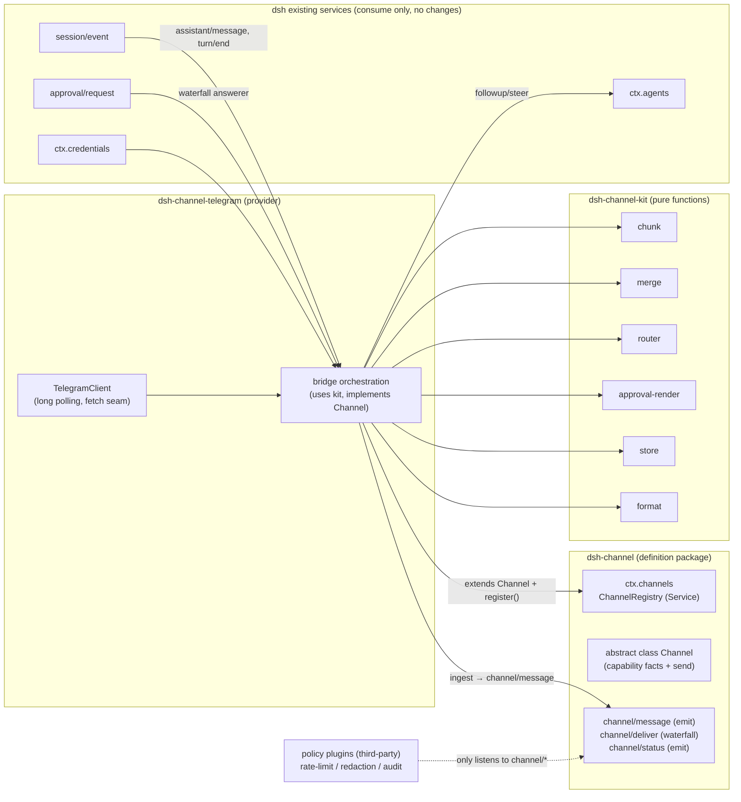

# dsh-channel Design & Technical Document

> Version: v0.3 · Date: 2026-08-18
> The R1–R10 hard constraints and acceptance criteria (A1–A6) have been merged into §6/§7; this document is the single design source. It describes this repo's own design, implementation, and roadmap — nothing else.
> dsh baseline: `@deepseek-ai/dsh-*@0.2.0-rc.2`; the line-by-line core alignment lives in `docs/dsh-core-reference.md`.

---

## 0. The One-Line Design

**`ctx.channels` is a registry core that copies the shape of `LlmRuntime`; `Channel` is a plain abstract-class seam that copies the shape of `LlmAdapter`; the six grunt-work modules are a pure-function library that never touches IO; inbound messages land in the session log with a mergeable `source.kind: 'channel'`, and idempotency is derived from log folding; approval is an answerer on the `approval/request` waterfall that "only answers for its own agent, must call `next()` on timeout, and never defaults to allowing".**

The structure is **two fixed public packages + one provider per platform (an open set)**, with unchanged responsibility boundaries:

| Layer | Package | One-liner | npm name (suggested) |
|---|---|---|---|
| Contract (the only core) | `dsh-channel` | The contract: `declare module` + `abstract class Channel` + `channel/*` events + message types. Zero implementation | `dsh-channel` |
| Pure-function library (the only one) | `dsh-channel-kit` | Pure functions for the six grunt-work modules + the `ChannelStore` interface and its JSON-file implementation | `dsh-channel-kit` |
| provider (the 1st…Nth) | `dsh-channel-telegram` (the 1st) | One per platform: implements the `Channel` capability facts + `send`, wired into the full kit pipeline | its own npm name |

The first two layers are the fixed public layer; the provider is an **open set** — this repository adds implementations platform by platform (Telegram is the 1st, Discord / WeChat / Feishu / … come later), each new platform adds exactly one package, and `dsh-channel` / `dsh-channel-kit` remain unchanged (A5).

---

## 1. Design Foundations (the part that decides the design)

### 1.1 The Shape Answers the dsh Source Gives

| Question | Answer | Source |
|---|---|---|
| What a one-to-many registry looks like | `LlmRuntime extends Service` (a concrete class, `ctx.llm`) + `registerAdapter(providers, adapter)` returns a handle with `dispose`; **the adapter is a plain abstract class, not a Service** | `packages/llm/llm/src/index.ts` |
| What a definition package looks like | One file holds everything: `declare module` (Context + Events), an abstract class (capability facts as `get` conservative defaults), type exports | `packages/fs/fs/src/index.ts` |
| How to write a pure-event bypass | Provide no service, only `ctx.on('fs/*')`, one piece of state per `apply()`, disposer resets to zero | `packages/fs/fs-observation-policy/src/index.ts` |
| Dependency direction | Across dsh packages always `peerDependencies` (+ devDeps for tests), `dependencies` keeps only third parties | `packages/fs/tool-fs/package.json` |
| Optional-dependency degradation | `import type {} from '...'` + `ctx.get('approval')`, missing → deny, with a comment noting "historical degrade to deny" | `packages/core/tools/src/index.ts:1678` |

**Design ruling: `Channel` does not extend `Service`.** R6's illustrative code wrote `extends Service`, but R5 also states "mirror LlmRuntime + multiple adapters, same shape" — and `LlmAdapter` is exactly a plain abstract class. A Service exclusively owns one ctx key; with multiple platforms coexisting there is no second key to occupy. The provider's lifecycle is carried by its own plugin fiber, and the registration entry is reclaimed by the disposer returned from `ctx.channels.register()`. This is consistent with R1/R5, and removes one layer of Cordis proxying.

### 1.2 APIs to Verify: All Verified

| Item to verify | Verification result |
|---|---|
| `ctx.agents` create / deliver / output | `ctx.agents.create({ sessionId, meta: { cwd, agentPreset… }, agentOptions: { provider, model }, setup? })` → `AgentHandle { agent, dispose }`; `ctx.agents.resume({ resumeSessionId, … })` resumes a persisted session (depends on `sessionPersistence`); `ctx.agents.get(id)` returns the bare `Agent`. Inbound delivery: `agent.followup(msg)` (a separate new turn and wakes it) / `agent.steer(msg)` (interjection, consumed at the nearest step boundary) / `agent.inject(msg)` (injects context, does not wake). Output has no callback API — **read `assistant/message` / `turn/end` off the `session/event` stream**. `agent.status` (`idle`/`running`) and the `agent/status` event can drive typing indicators. |
| `session/event` schema | `(session: Session, event: SessionEvent)`, emit mode, post-commit, fire-and-forget; `SessionEvent = { type, seq, time, data, ignorable? }`. `SessionEventMap` is extended via `declare module '@deepseek-ai/dsh-session/types'` declaration merging (user-approval's `approval/asked`/`approval/decided` are the ready-made example). Note: **bare events land outside a turn and are dropped as a crash tail on reload** — extending log events requires wrapping them inside an open turn (see the §4.5 store trade-off). |
| `approval/request` signature and timeout | Waterfall: `(req: ApprovalRequest, next) => Promise<ApprovalOutcome>`; `req = { agent, toolName, callId?, reason?, signal? }`; outcome ∈ `'allowed-once' | 'rejected' | 'cancelled' | 'unavailable'`, no answerer / answerer throws → `'unavailable'` (fail-closed); `signal` abort → `'cancelled'`, late answers are dropped. The `'never'` session policy rejects in place before dispatch. The audit pair (asked/decided) is logged by `ApprovalService`; the answerer need not care. |
| `ctx.sessions.fork(source, boundary?, childSessionId?)` | Can only fork a prefix at a completed turn boundary (`OPEN_TURN` is rejected); the channel scenario corresponds to `/fork`-style commands, **not in v1**, just reserve the interface. |
| `ctx.credentials` | `ctx.credentials.resolve(credentialRef('TELEGRAM_BOT_TOKEN'))` → `{ value, source } | undefined`; **re-resolve on every operation, never cache across operations** (changing credentials needs no restart). |
| Telegram Bot API | Text limit **4096** chars/message (caption 1024); `getUpdates` long polling and `setWebhook` are mutually exclusive, v1 uses long polling (no public-IP dependency); rich text uses **HTML parse mode** (MarkdownV2 needs escaping of the eighteen characters `_*[]()~`>#+-=|{}.!`, fragile — so HTML + plain-text fallback); approvals can use an **inline keyboard** (`callback_data` ≤64 bytes, after the callback must call `answerCallbackQuery` to clear the spinner); `editMessageText` supports draft-style streaming (v2); rate limit ~30 msg/s globally, ~1 msg/s per chat (20/min for groups), outbound needs throttling. |

### 1.3 Adopted Design Principles

The comparative survey that preceded this design is deliberately not part of this document; what
it produced is the following set of rules, each of which now has an owner in the tree:

- **The six grunt-work modules are the problem's inherent shape.** Independent channel
  implementations keep re-growing the same six pieces (chunk / merge / router / approval-render /
  store / format); building them once as pure functions is the kit's reason to exist (§4).
- **A tiny required adapter surface scales; everything else is a capability fact.**
  `connect / disconnect / send / sendTyping` plus `get`-style capability facts with conservative
  defaults covers many platforms without forking the interface; optional abilities degrade in the
  base class instead of appearing as platform-specific methods (§3.3, R6).
- **A registry + events beats built-in platform lists.** Any design where adding a platform
  touches a fixed set of core call sites turns every platform into a core patch; the
  `ctx.channels` registry collapses that to one plugin (§3.4).
- **Idempotency derives from the session log, not from private state.** Claimed messages are
  necessarily in the log; the store is only a safety net and an optimization (§4.5, R7).
- **The delivery ledger is non-negotiable.** The final reply that was "generated but not confirmed
  delivered" is the only artifact that can vanish without a trace. `pending → attempting →
  delivered/failed/abandoned`, and a redelivery after an `attempting` crash carries a visible
  "(recovered resend)" marker — honest at-least-once, never silent duplication or loss (§4.5).
- **The three merge iron rules.** Media is never merged into a text batch; control commands
  (stop / approval replies) are never delayed by the debounce window; empty text is never merged
  (§4.2).
- **Streaming is gated by capability facts and timers.** `streamingMode: off | block | progress`;
  only a timer trigger may create a draft/progress message, so fast answers produce zero noise.
  v1 ships `off` + progress; `block` (draft editing) waits for v2 (§4.1).
- **Platform hints go into the system prompt.** A model that is not told which platform it is on
  emits markdown on platforms that render none → kit `promptHint()` (§4.7).
- **The allowlist is the security boundary** — required, with no permissive default; it is the
  front door of prompt injection (§5.1).
- **Engineering conventions:** self-message filtering against loopback, redacting platform
  identifiers from logs, exponential backoff + jittered reconnect, message-length limits as
  explicit per-platform constants.

---

## 2. Overall Architecture



Two data flows:

- **Inbound**: platform message → provider dedupe (store + log folding) → `ctx.channels.ingest()` emits `channel/message` → the provider itself (or a future generic consumer) via merge/router → `agent.followup()` → becomes a `user/message` (`source.kind: 'channel'`, carrying the platform message id) written to the log.
- **Outbound**: read `assistant/message` / `turn/end` off `session/event` → assemble `OutboundMessage` → `ctx.channels.deliver()` goes through the `channel/deliver` waterfall (policy plugins intercept here) → write to the delivery ledger → `Channel.send()` sends in segments → mark delivered.

**Why does the provider both emit and consume `channel/message`?** The event is not for itself — it is the policy extension point (R4: rate-limit, redaction, and audit plugins work by only listening to events) and the seam for a future "generic consumer plugin". In v1 the provider closes the loop itself, and still emits the event; if shareable consumer logic appears when validating the next platform, it can be moved into a separate plugin without changing the contract.

---

## 3. The `dsh-channel` Definition Package

### 3.1 The Contract (complete declare module)

```ts
// packages/channel/src/index.ts — the whole contract in one declare block, owned by the definition package (R4)
import { Context, Service } from '@deepseek-ai/cordis'

declare module '@deepseek-ai/cordis' {
  interface Context {
    channels: ChannelRegistry
  }
  interface Events {
    /**
     * A normalized inbound message has been received by some provider (after dedupe).
     * Observational event: policy plugins do audit/statistics here; carries no routing decision.
     * @mode emit
     */
    'channel/message'(msg: InboundMessage): void
    /**
     * One outbound delivery. Policy plugins may wrap (rewrite text, rate-limit delay) or
     * short-circuit (return a suppressed receipt to intercept the message); pure observers must call next().
     * innermost default = the registry locates the Channel and calls its send.
     * @mode waterfall
     */
    'channel/deliver'(out: OutboundMessage, next: () => Promise<DeliveryReceipt>): Promise<DeliveryReceipt>
    /**
     * A provider connection state change (connecting/connected/disconnected/fatal).
     * @mode emit
     */
    'channel/status'(channelId: string, status: ChannelStatus, error?: Error): void
  }
}

// Inbound messages enter the session log with platform identity — the idempotency anchor (R7)
declare module '@deepseek-ai/dsh-llm' {
  interface MessageSourceMap {
    channel: {
      kind: 'channel'
      /** provider id, e.g. 'telegram' */
      channel: string
      /** platform session key (DM = chat id, group = chat id; meaning defined by the provider, just needs to be stable) */
      chatKey: string
      /** sender's platform id */
      senderId: string
      /** platform message ids making up this user/message (multiple after merge) */
      messageIds: string[]
    }
  }
}
```

The `MessageSourceMap` declaration merging is the fulcrum of the whole design: once an inbound message is claimed by an agent, **the platform message id becomes a durable fact carried by the `user/message` event**. After a restart the provider can fold the log to reconstruct "which platform messages were already handled", with no shadow session state (R7, off-track signal 5).

### 3.2 Message Types

```ts
/** Platform-agnostic inbound message. media in v1 keeps only a placeholder description, not downloaded. */
export interface InboundMessage {
  readonly channel: string          // provider id
  readonly chatKey: string          // stable session key
  readonly senderId: string
  readonly senderName?: string
  readonly messageId: string        // platform message id (dedupe key)
  readonly chatType: ChatType       // 'direct' | 'group' | 'thread'
  readonly text: string
  readonly timestamp: number        // epoch ms
  /** v1 doesn't process media, but carries the fact so merge knows "not mergeable" */
  readonly hasMedia: boolean
  /** whether the bot was @-mentioned in a group (decided by the provider; v1 does not route groups, only records) */
  readonly mentionsBot?: boolean
}

/** Outbound message: semantic content + presentation intent; segmenting/escaping is the provider's job */
export interface OutboundMessage {
  readonly channel: string
  readonly chatKey: string
  /** markdown source text; the provider degrades rendering per its own formatTier */
  readonly markdown: string
  /** structured choices (approval/clarification); on buttonless platforms the consumer pre-degrades to numbered text */
  readonly choices?: readonly OutboundChoice[]
  /** idempotency key: a duplicate deliver with the same key should be blocked by the ledger */
  readonly deliveryKey: string
  /** provenance (for audit): which event from which session */
  readonly origin?: { sessionId: string; seq?: number }
}

export interface OutboundChoice { readonly id: string; readonly label: string }

export interface DeliveryReceipt {
  readonly status: 'sent' | 'suppressed' | 'failed'
  /** platform-side message id (multiple when segmented) */
  readonly platformMessageIds?: readonly string[]
  readonly error?: string
}

export type ChatType = 'direct' | 'group' | 'thread'
export type ChannelStatus = 'connecting' | 'connected' | 'disconnected' | 'fatal'
```

### 3.3 The `Channel` Abstract Class (seam)

```ts
/**
 * Abstract base class for platform providers. A plain abstract class, not a Service (aligned with LlmAdapter):
 * the lifecycle is carried by the provider plugin's own fiber, registered via ctx.channels.register().
 * The required surface is deliberately tiny (§1.3: a tiny required surface scales);
 * capability differences always go through "capability facts + degradation"; never add methods only one platform can implement (R6).
 */
export abstract class Channel {
  /** stable provider id ('telegram', 'discord'…), the registry key */
  abstract readonly id: string

  // ---- capability facts: conservative base-class defaults, overridden by implementations (copied from FileSystem.sandboxMode) ----
  /** max characters per message; undefined = no known limit */
  get maxMessageChars(): number | undefined { return undefined }
  /** rich-text tier: the consumer chooses the format degradation path from this */
  get formatTier(): 'plain' | 'markdown' | 'html' { return 'plain' }
  /** whether structured choices (buttons/cards) are supported; when false, approvals degrade to numbered replies */
  get supportsChoices(): boolean { return false }
  /** whether editing sent messages is supported (prerequisite for draft-style streaming, v2) */
  get supportsEdit(): boolean { return false }
  /** whether typing indicators are supported */
  get supportsTyping(): boolean { return false }
  /** supported conversation shapes */
  get chatTypes(): readonly ChatType[] { return ['direct'] }

  // ---- required behavior ----
  /**
   * Sends a piece of text already rendered per platform constraints (optionally with choices).
   * Segmentation is done by the caller; the implementation only handles a single uplink and error reporting.
   */
  abstract send(chatKey: string, text: string, opts?: {
    choices?: readonly OutboundChoice[]
    signal?: AbortSignal
  }): Promise<{ platformMessageId: string }>

  // ---- optional behavior: harmless degradation by default ----
  /** typing indicator; no-op by default */
  async sendTyping(_chatKey: string): Promise<void> {}
}
```

### 3.4 `ChannelRegistry` (core)

```ts
export class ChannelRegistry extends Service {
  private entries = new Map<string, Channel>()

  constructor(ctx: Context) { super(ctx, 'channels') }

  /**
   * Registers a provider. A duplicate id throws (aligned with LlmRuntime's DUPLICATE semantics).
   * Returns a disposer via ctx.effect: the registration is reclaimed automatically when the provider unloads (R1).
   */
  register(channel: Channel): () => void {
    return this.ctx.effect(() => {
      if (this.entries.has(channel.id)) {
        throw new Error(`channel "${channel.id}" is already registered`)
      }
      this.entries.set(channel.id, channel)
      return () => { this.entries.delete(channel.id) }
    }, 'channels.register()')
  }

  get(id: string): Channel | undefined { return this.entries.get(id) }
  list(): Channel[] { return [...this.entries.values()] }

  /** called when a provider receives a deduped inbound message: normalized assertion + broadcast */
  ingest(msg: InboundMessage): void {
    this.ctx.emit('channel/message', msg)
  }

  /**
   * Unified outbound entry: goes through the channel/deliver waterfall, the innermost default locates
   * the provider and sends. Policy plugins (rate-limit / redaction / audit) wrap or short-circuit on the waterfall.
   */
  async deliver(out: OutboundMessage): Promise<DeliveryReceipt> {
    return this.ctx.waterfall('channel/deliver', out, async (): Promise<DeliveryReceipt> => {
      const channel = this.entries.get(out.channel)
      if (channel === undefined) return { status: 'failed', error: `no channel "${out.channel}"` }
      // segmentation + rendering come in as one message after the consumer side finishes, or call kit here (see §5 orchestration choice)
      const result = await channel.send(out.chatKey, out.markdown, { choices: out.choices })
      return { status: 'sent', platformMessageIds: [result.platformMessageId] }
    })
  }
}
```

Acceptance for policy-style extension (R4): an "audit plugin" works completely with just `ctx.on('channel/message')` + `ctx.on('channel/deliver', (out, next) => next())`, importing no provider and implementing no `Channel` — isomorphic with `fs-observation-policy`.

### 3.5 Definition Package package.json Essentials

```jsonc
{
  "name": "dsh-channel",
  "peerDependencies": {
    "@deepseek-ai/cordis": ">=…",
    "@deepseek-ai/dsh-llm": ">=…"        // MessageSourceMap merging + UserMessage type
  },
  "keywords": ["dsh", "dsh-plugin"]
}
```

peerDeps **narrow the version range** (dsh is a developer preview, see §9 risks). The definition package does not depend on `dsh-session` / `dsh-agent` — the contract only contains its own types and `dsh-llm`'s source merging; `grep dsh-channel-telegram` must have zero hits in this package (A2).

---

## 4. The Six Grunt-Work Modules of `dsh-channel-kit`

**Overall principle**: each module is a pure function of "input → output, no IO, no timers, no global state"; time is passed in as a parameter, and timers and the filesystem are isolated in two clearly-marked impure files (`store/json-file.ts`, `runtime/timers.ts`). kit does not import cordis — people not using dsh can take it to wire up their own bot (documentation and templates matter more than features).

### 4.1 chunk — How to Split Long Replies

```ts
export interface ChunkOptions {
  maxChars: number                     // from Channel.maxMessageChars
  numbering?: 'none' | 'prefix'        // '(i/n)' prefix; default none
  countBy?: 'codepoint' | 'utf16'      // WeChat counts by codepoint, Telegram by UTF-16; default codepoint
}
export function chunkText(markdown: string, opts: ChunkOptions): string[]
```

Algorithm:

1. **Split by markdown blocks**, treating fenced code blocks as atomic — never cut through code blocks or links (§4 hard requirement);
2. Greedy bin packing to `maxChars`;
3. An over-long single atomic block degrades to a hard cut, but **code blocks get fences re-added on a hard cut** (at the cut, add ``` to close/reopen, keeping every segment renderable);
4. When `numbering: 'prefix'`, apply recursive prefix-width convergence (the prefix consumes budget, the segment count and prefix width affect each other, converges in 5 rounds, falls back to no prefix on failure);
5. Within a plain-text segment, prefer breaking at newlines / `.` / `. `.

Streaming trade-off: **v1 only does final delivery** (at the `assistant/message` event level) — platform rate limits + most platforms lacking edit capability make per-token outbound infeasible; perceived latency for long-running tasks is compensated by the progress heartbeat (§5.4). Draft streaming on `supportsEdit` platforms (`block` streaming mode + "only a timer trigger creates the draft" gating) goes to v2.

### 4.2 merge — Merging Consecutive Sends

The key to making it a pure function: **the reducer only computes state and actions; timers live outside**.

```ts
export interface MergeState { readonly buffer: readonly string[]; readonly deadline: number | undefined }
export type MergeInput =
  | { kind: 'message'; text: string; hasMedia: boolean; isCommand: boolean; now: number }
  | { kind: 'tick'; now: number }          // fed in from a timer/polling edge
export type MergeEffect =
  | { kind: 'flush'; text: string }        // merged text delivered to the router
  | { kind: 'ack-long' }                   // for over-long input, first reply "received, processing"
  | { kind: 'armTimer'; at: number }       // ask the outside to feed one tick at time at
export function mergeReduce(state: MergeState, input: MergeInput, opts: MergeOptions): { state: MergeState; effects: MergeEffect[] }
```

Contract (the three merge iron rules + the control suffixes):

- `isCommand` (starts with `/` or an approval reply word) **never enters the buffer, bypasses immediately** — stop/approval must not be delayed by debounce;
- A `hasMedia` message **immediately flushes the current buffer and is delivered separately** — attachments are not merged with the text batch;
- `..` suffix = keep waiting (resets the window); `!!` suffix = flush immediately; bare suffixes ignored (configurable off);
- Default window 5s; buffer joined with `\n`;
- **Interjecting while the agent is thinking**: merge doesn't care — after flush the consumer picks the delivery method per agent state: `idle → followup`, `running → steer` (dsh's inbox semantics naturally answers this question).

Crash recovery: every buffer change produces a snapshot (the consumer writes it to the store's `mergeBuffers`); at startup, after `restore`, treat it as just-arrived and reopen the window.

### 4.3 router — Platform Conversation → dsh Session

```ts
export interface RouteContext {
  readonly channel: string
  readonly boundSessions: Readonly<Record<string, string>>   // chatKey → sessionId (store.bindings)
  readonly liveSessionIds: readonly string[]                  // projection of ctx.agents.list()
}
export type RouteDecision =
  | { kind: 'command'; command: string; args: string }        // starts with /, handled locally
  | { kind: 'approval-reply'; raw: string }                   // handed to approval-render.parse
  | { kind: 'route'; sessionId: string; create: boolean }     // delivery target
  | { kind: 'drop'; reason: 'group-unsupported' | 'empty' }
export function route(msg: { chatKey; text; chatType; mentionsBot? }, ctx: RouteContext, opts: RouterOptions): RouteDecision
```

- **Default policy: one session per chat**, with the sessionId convention `channel:<channelId>:<chatKey>` (ownership recoverable from the id); `/new` rotates to `channel:<channelId>:<chatKey>:<ts>` and updates the binding.
- **Resume before create**: when the target sessionId is not in the live list, the consumer first tries `ctx.agents.resume({ resumeSessionId })` (no context loss across restart when persistence is deployed, the other half of A4), then `create` on failure. The router only gives the decision; agents calls stay on the consumer side.
- Groups: v1 `chatType !== 'direct'` → `drop` (unclear group ownership semantics + a large prompt-injection surface); the `mentionsBot` fact is already in the type, so enabling groups in v2 won't touch the contract.
- One user, multiple devices: converges naturally — the routing key is the chat, not the device.

### 4.4 approval-render — Expressing Approval on Buttonless Channels

```ts
export interface PendingApproval { readonly num: number; readonly requestId: string; readonly toolName: string; readonly expiresAt: number }
export function renderApproval(req: { toolName; reason?; num: number }, caps: { supportsChoices: boolean }, opts): 
  { kind: 'choices'; text: string; choices: OutboundChoice[] }   // choices: [{id:'appr:<num>:1','approve'},{id:'appr:<num>:0','reject'}]
| { kind: 'text'; text: string }                                  // "reply 1 to approve / 2 to reject"
export function parseApprovalReply(input: { text?: string; choiceId?: string }, pending: readonly PendingApproval[]):
  { kind: 'answer'; num: number; outcome: 'allowed-once' | 'rejected' } | { kind: 'not-an-answer' }
```

The consumer's answerer orchestration contract (the non-pure-function part, pinned down in the docs and templates):

1. **Only answer for its own agent**: `req.agent.session.id` is not a session routed by this channel → immediately `return next()` (to avoid stealing the web UI's approvals);
2. **Show first, then wait**: the question is sent first; the user cannot answer what they can't see;
3. Numbered concurrency: multiple pendings are distinguished by `#n`; bare `1`/`2` are valid only when there is exactly one pending;
4. **On timeout → `return next()`**: hand the decision back to the downstream answerer chain (the web UI may still be showing it); no one on the chain → `ApprovalService` records `'unavailable'`, still fail-closed. **No path ever defaults to allowing**;
5. `req.signal` abort → clear pendings; withdrawing the prompt is optional.

R2 acceptance closes the loop here: without an approval plugin installed, the `approval/request` event is never emitted at all (`ctx.tools` degrades to deny on its own), so this plugin's answerer sits idle on the event at zero cost — send/receive is unaffected (A3).

### 4.5 store — The Small Slice the Log Cannot Derive

Establish the rule first (§4: "prefer deriving from the session log; don't build separate state"):

| Fact | Owner | Reason |
|---|---|---|
| Whether a platform message was already handled by the agent | **session log**: fold `user/message`'s `source.messageIds` | Claimed messages are necessarily in the log (§3.1's source design) |
| The polling cursor before the claimed messages | store (an optimization) | Losing the cursor is fine too — log folding is the safety net; the cursor only saves folding cost |
| Undelivered buffers inside the merge window | store | Not yet in the log, so the log cannot derive them |
| chatKey → sessionId binding | carried by the conventional sessionId (`channel:tg:<chatKey>`); only the `/bind` exception goes into the store | If it's recoverable from the id, don't persist it |
| Outbound delivery watermark | store (delivery ledger) | `assistant/message` is in the log, but "whether it reached the platform" is not; also, appending a bare event after the turn closes gets dropped as a crash tail on reload (§1.2), so the session log cannot hold this fact |

```ts
export interface ChannelStore {
  // inbound dedupe (TTL map with an outcome; see §13.2)
  seenInbound(messageId: string): boolean
  inboundOutcome(messageId: string): 'handling' | 'done' | 'failed' | undefined
  markInbound(messageId: string, outcome?: 'handling' | 'done' | 'failed'): void
  // merge crash recovery
  setMergeBuffer(chatKey: string, buffer: readonly string[]): void
  mergeBuffers(): Readonly<Record<string, readonly string[]>>
  // explicit binding (/bind exception path)
  setBinding(chatKey: string, sessionId: string | undefined): void
  bindings(): Readonly<Record<string, string>>
  // outbound ledger (pending → attempting → delivered/failed/abandoned state machine)
  recordDelivery(key: string, out: { chatKey: string; textHash: string }): void   // pending
  markAttempting(key: string): void
  markDelivered(key: string, platformMessageIds: readonly string[]): void
  markFailed(key: string, error: string): void
  /** recovered at startup: pending = redeliver directly; attempting/failed = redeliver with a "recovered resend" marker; over limit → abandoned */
  /** Abandons only when BOTH the attempt cap is reached AND the entry is old enough (§13.2). */
  sweepRecoverable(opts?: { now?: number; minAgeMs?: number }): Array<{ key: string; state: 'pending' | 'attempting' | 'failed'; chatKey: string; attempts?: number; errorKind?: SendErrorKind }>
  flush(): Promise<void>
}
export function createJsonFileStore(path: string): ChannelStore   // tmp+rename atomic write, 500ms debounce
```

Ledger semantics: an `attempting` crash means the platform **may already have received it** — a redelivery must carry a visible "(recovered resend, may duplicate)" marker; honest at-least-once beats silent duplication or silent loss. attempts are capped, expired entries become `abandoned`, and a ledger failure must never block real sends (everything wrapped in try/catch).

The interface is pure data operations + an explicit `flush`; unit tests use an in-memory implementation, and `createJsonFileStore` is the only file in the package that touches the filesystem (A6).

### 4.6 format — Markdown → Platform Tier

```ts
export function renderForTier(markdown: string, tier: 'plain' | 'markdown' | 'html'): string
```

Degradation table (v1 scope):

| Element | html (Telegram) | markdown (Discord-like) | plain (WeChat-like) |
|---|---|---|---|
| Fenced code | `<pre>` + HTML escaping | as-is | keep the fence lines verbatim (user-recognizable) |
| Inline code | `<code>` | as-is | strip backticks |
| **bold** | `<b>` | as-is | strip asterisks |
| Link `[t](u)` | `<a href>` | as-is | `t (u)` |
| Table | degrade to `<pre>` aligned text | as-is | aligned text |
| Rest / unrecognized | as-is after HTML escaping | as-is | as-is |

Rule: **incomplete structures stay literal** (a fragmentary `<pre>` gets rejected wholesale by Telegram); escaping is done only once per corresponding tier; call order is fixed `format → chunk` (render first, then segment; chunk's fence re-adding guarantees each segment is independently valid).

### 4.7 Bonus: promptHint

```ts
export function promptHint(channel: { id; formatTier; maxMessageChars; supportsChoices }): string
// → "You are talking to the user through Telegram: limited HTML rich text is supported, a single message is capped at 4096 characters, and buttons are supported. Avoid wide tables; long code will be segmented."
```

The provider registers this sentence as an agent-scoped systemPrompt context segment via `setup(agentCtx)` when creating the agent (`ctx.inject(['systemPrompt'], …)` on `agentCtx`, optional dependency, skip if missing). Without this step, the model emits markdown tables on plain-text platforms.

---

## 5. The `dsh-channel-telegram` Provider

### 5.1 Plugin Skeleton (R1/R2/R9 Land Item by Item)

```ts
export const name = 'dsh-channel-telegram'
export const inject = ['channels', 'agents', 'credentials']   // approval is optional, not in inject (R2)
import type {} from '@deepseek-ai/dsh-user-approval'          // type-only

export const Config: Schema<TelegramConfig> = Schema.object({
  /** allowed Telegram user ids. Required, no permissive default (this is the front door of prompt injection) */
  allowedUserIds: Schema.array(Schema.number()).required(),
  provider: Schema.string().default('deepseek-official'),
  model: Schema.string(),
  cwd: Schema.string(),
  agentPreset: Schema.string(),
  pollingTimeoutSec: Schema.number().default(30),
  mergeWindowSec: Schema.number().default(5),
  approvalTimeoutSec: Schema.number().default(120),
  statePath: Schema.string(),                                  // default $DSH_HOME/channel-telegram/state.json
})

export function apply(ctx: Context, config: TelegramConfig) {
  const store = createJsonFileStore(resolveStatePath(config))
  const channel = new TelegramChannel(/* client seam */)
  ctx.channels.register(channel)                               // disposer reclaims automatically
  const bridge = new TelegramBridge(ctx, config, channel, store)
  ctx.effect(() => {                                           // side-effect creation and teardown written together (R1)
    bridge.start()                                             // long-polling loop + session/event listener + approval answerer
    return async () => { await bridge.stop(); await store.flush() }
  }, 'channel-telegram.serve')
}
```

- The token **only goes through `ctx.credentials.resolve(credentialRef('TELEGRAM_BOT_TOKEN'))`**, resolved on every API call (changing the token needs no restart); the config file provides no token field, and logs redact it across the whole path (client-layer `redactToken`).
- `TelegramChannel extends Channel`: `maxMessageChars = 4096`, `formatTier = 'html'`, `supportsChoices = true`, `supportsTyping = true`, `supportsEdit = true` (fact reporting; draft streaming uses it only in v2), `chatTypes = ['direct']` (v1).
- The client uses a fetch-seam design (constructor-injected `fetch`/`baseUrl`, swapped with fakes in tests), and adds `sendMessage`'s `reply_markup` (inline keyboard) and `answerCallbackQuery`, plus `getUpdates`'s `allowed_updates: ['message', 'callback_query']`.

### 5.2 Inbound Orchestration (the Wiring Order of the Six Grunt-Work Modules)

```
getUpdates batch
  └─ each message:
       store.seenInbound? ── yes → drop                    (polling-resend safety net)
       log-folded seen?   ── yes → drop + markInbound      (first safety net after restart, see below)
       allowlist?         ── no  → reject-reply + drop
       ctx.channels.ingest(inbound)                        (broadcast the fact)
       route() ──┬─ command        → execute locally (/start /new /status /help)
                 ├─ approval-reply → parseApprovalReply → broker answer
                 └─ route          → mergeReduce ──flush──→ deliver:
                        agent = get/resume/create(sessionId, {setup: promptHint})
                        agent.status === 'running' ? agent.steer(msg) : agent.followup(msg)
                        msg.source = { kind:'channel', channel:'telegram', chatKey, senderId, messageIds }
  └─ offset = update_id + 1 (advance only after the whole batch is processed successfully; failed items do not advance the cursor, dedupe prevents re-injection)
```

The cold-path log folding after restart: for each actively-bound session, sweep `session.snapshotEvents()` once, collect the `messageIds` where `source.kind === 'channel'` and refill the seen set, then everything goes through the hot path. Kill the process and restart → the session is rebuilt from the log via `agents.resume`, and already-injected messages are not re-injected thanks to the seen set (first half of A4).

### 5.3 Outbound Orchestration

```
ctx.on('session/event') filters sessions bound to this channel:
  turn/start        → channel.sendTyping (throttled, at most once per 5s)
  assistant/message → text = textOf(event)
                      deliveryKey = `${sessionId}:${event.seq}`        (seq is a natural idempotency key)
                      store.recordDelivery(key, …)
                      ctx.channels.deliver({ channel:'telegram', chatKey, markdown:text, deliveryKey })
  turn/end(non-completed) → push a status line (❌/⏹/↯ + reason label table)
Beyond deliver's innermost (the registry default), the provider side completes:
  renderForTier(markdown,'html') → chunkText({maxChars:4096}) → channel.send per segment
  1s throttle between segments (Telegram per-chat rate limit); one segment fails → stop sending the rest (prevents reordering) → markFailed
  all succeed → markDelivered
At startup store.sweepRecoverable() → redeliver with a "(recovered resend)" marker → no duplicate delivery of already-delivered ones (second half of A4)
```

On HTML send failure, automatically degrade to plain text and retry once (the two-path send).

### 5.4 Approval and progress

- **Approval**: `supportsChoices = true` → inline keyboard (`callback_data: appr:<num>:<1|0>`, a platform-agnostic callback id convention); a callback arrives → `answerCallbackQuery` + broker answer + edit the original message to "✅ Approved". Text replies (`approve/reject/1/2`) are valid at the same time — buttons are just a shortcut, keeping the degradation path always available and testable. Timeout → `next()` (§4.4 contract).
- **progress heartbeat** (optional, off by default): only when a turn has been open longer than `digestIntervalSec`, send a one-line digest ("⏳ turn 3 · 5 tools called · latest: Bash"; the digest line folds from the log, so it's naturally replayable); fast tasks produce zero noise (the timer-gating principle: only a timer trigger creates progress output).

### 5.5 Wiring (R9)

```yaml
# cordis.patch.yml (package.json: "dsh": { "bundle": { "patch": "./cordis.patch.yml" } })
- insert:
    - id: channel-telegram
      name: dsh-channel-telegram
      config:
        allowedUserIds: [123456789]
        model: deepseek-flash
        cwd: !!js process.env.HOME + '/agent-workspace'
# the token is not in this file: the TELEGRAM_BOT_TOKEN credential (web UI credentials page) or an environment variable
```

Registration lives on the plugin's own ctx layer (R10): no hardcoded global assumption, so some agent preset can later mount only one channel in an isolated group.

---

## 6. R1–R10 Compliance Cross-Reference

| Rule | Where it lands | Acceptance action |
|---|---|---|
| R1 reversible | All side effects inside `ctx.effect`/`register` disposers; `bridge.stop()` converges polling, clears merge timers, settles pending approvals, flushes the store | Load-unload-load ×3 script (§7 T1) |
| R2 inject | `inject = ['channels','agents','credentials']`; approval type-only + event mounting is naturally optional | Full pipeline runs without approval installed (T3) |
| R3 package separation | Consumers/policy plugins peer only `dsh-channel`; the provider name appears in no deps/peerDeps | CI grep (T2) |
| R4 contract | §3.1 single declare block; policy plugins usable via pure events | Audit-plugin example (T6) |
| R5 shape | Registry = Service core, Channel = plain abstract-class seam, aligned with LlmRuntime/LlmAdapter | Code-review cross-check |
| R6 capability facts | §3.3 six gets, conservative defaults; zero platform-specific methods on the interface | Each added platform changes no contract (T7/A5) |
| R7 log discipline | source.messageIds into the log; idempotency = log folding + store safety net; no shadow session state | Kill-process restart test (T4/A4) |
| R8 waterfall | approval answerer always `next()` for non-owned agents/on timeout; deliver observers must `next()` | Unit tests + review |
| R9 YAML wiring | §5.5; credentials via credentials | Review + config example runs |
| R10 scope | Registration on the caller's ctx; promptHint goes through the agent setup scope | isolate-group smoke test (v2) |

---

## 7. Tests and Acceptance

| # | Test | Corresponding acceptance |
|---|---|---|
| T1 | Load → unload → load ×3: fake client asserts no leftover polling, listener count back to zero, no duplicate delivery | A1 |
| T2 | CI script: `grep -r dsh-channel-telegram` has zero hits in the definition package and example consumers' deps/peerDeps | A2 |
| T3 | Compose without `dsh-user-approval`: send/receive normal; approval-requiring tools → tools themselves degrade to deny | A3 |
| T4 | Inject two messages → kill -9 → restart → `agents.resume` rebuilds; replay the polling batch and assert zero re-injection; ledger `attempting` entries redeliver with the recovery marker | A4 |
| T5 | Pure-function unit tests for the six modules (chunk fence re-adding / prefix convergence, merge three iron rules and `..`/`!!`, router decision table, approval numbering/timeout, store state machine, format degradation table), without booting dsh | A6 |
| T6 | Audit-plugin example: only event listening counts send/receive volume | R4 |
| T7 | **Next-platform skeleton** (Discord suggested: has buttons + threads + markdown tier, forming a capability contrast with Telegram's html tier): implement `Channel` capability facts + `send`, wire the full kit pipeline, **zero changes to `dsh-channel`/`dsh-channel-kit`** — A5's first reproduction | A5 |

Per T7's advice, **T7's interface-call checklist is listed in the first week of writing Telegram** (M3 and M4 are reasoned through in parallel), without waiting for M3 to finish.

---

## 8. Milestones (mapping §8)

| Phase | Deliverable | Exit |
|---|---|---|
| M0 ✅ | This document (research + all APIs to verify landed) | Achieved |
| M1 | `dsh-channel`: all §3 types + Registry + empty provider load/unload test | Empty implementation loads/unloads cleanly |
| M2 | `dsh-channel-kit`: six modules + T5 all green | A6 |
| M3 | `dsh-channel-telegram` end-to-end + T1/T3/T4 | A1 A3 A4 |
| M4 | Next platform (Discord / WeChat / Feishu / …) + T7; from then on **each added platform is one more reproduction of A5**, the repo keeps growing | A5 |
| M5 | npm publish + `dsh-plugin` topic + awesome-dsh-plugin PR + an "add a new platform" tutorial (one table for the required surface, one for the optional surface, itemized degradation notes) | — |
| M6 | Media (§10): contract adds `InboundMedia`/`OutboundMedia`/`supportsMedia`/`sendMedia`; Telegram `getFile` download + `sendPhoto`/`sendDocument` send | Image end-to-end (inbound lands in the log, outbound reachable) |
| M7 ✅ | Capability hardening (§12): inbound media size cap, generic outbound retry/backpressure queue, `mentionsBot` fix, reaction-based ack; plus the configuration/settings seam (§11) | P0 hardening green; full suite (channel+kit+config+3 providers) passes |
| M8–M10 ✅ | Capability reach: multi-account, reconciliation seam, reply/thread/silent delivery, pairing-login interface, outbound proxy | Contract additive only; A5 re-checked |
| M11–M14 ✅ | Mechanism hardening + the `ChannelBridge` handler layer (§13); M14 audits M11–M13 against the tree | Conformance suite + capability proofs per provider; providers hold transport only |

---

## 9. Risks and Open Questions

> The v1 design risks are below. The **live** list — what is still unverified, what is deferred and
> on which trigger, and which designs were considered and rejected — is
> `docs/dsh-channel-backlog.md`.

| Risk / question | Handling |
|---|---|
| dsh preview API breaking changes | Narrow peerDeps; `session/event`, `agents.create/resume`, `approval/request` are this design's only four dsh touchpoints, so the change surface is minimized |
| Segmentation position of the `channel/deliver` waterfall | v1: rendering + segmentation on the provider side, the waterfall passes the whole semantic message (policy plugins see full intent, not fragments). If policy plugins need per-segment interception, revisit in v2 — the contract is unchanged, only the innermost behavior is refined |
| merge timers and Cordis lifecycle | Timers created inside the bridge's effect, all cleared on dispose; the pure reducer guarantees tests don't need real time |
| Group-chat semantics | v1 explicitly drops; the `chatType`/`mentionsBot` facts are already in the contract, enabling groups won't touch `dsh-channel` |
| Media messages | **Already in the plan (§10)**: inbound images land in the log via `ctx.attachments.saveImage`, other media carry `fileRef` facts; outbound goes through the `supportsMedia`/`sendMedia` capability facts |
| Whether the outbound ledger belongs in the session log | Ruled not (§4.5): bare events outside a turn get dropped on reload, and delivery status is not a model-visible fact; keep the clean boundary between the two worlds "log = what the model sees, store = the platform handoff" |

---

## 10. Media Capability (Receive + Send) Design

> Status: planned (M6) · Motivation: images/files are high-frequency interactions, so media receive and send are in scope.

### 10.1 dsh Native Ingredients (0.2 verified)

- `ContentBlock` has an `image` block: `ImageBlock { type:'image', attachment: ImageAttachmentRef }` (`dsh-llm/types.d.ts:54`).
- `ctx.attachments` = `AttachmentStore` (`dsh-attachment`): `saveImage(input) → ImageAttachmentRef` (validate + persist + issue a reference), `readImage(ref)`, `validateImage(input)`.
- **Key boundary**: the channel side still wires **images only** (`saveImage`/`ImageAttachmentRef`); 0.2's attachment seam grows a file surface (`FileAttachmentRef`) upstream, but these packages don't consume it yet, and production adapters declare text-only output, so the model side currently barely emits image blocks. → Media mainly flows **inbound (users send images for the model to see) + outbound (channels/tools send files to users)**.

### 10.2 Inbound Receive

```ts
// added to InboundMessage (hasMedia is kept, for merge's "don't merge when there's an attachment" decision)
readonly media?: ReadonlyArray<InboundMedia>
interface InboundMedia {
  readonly kind: 'image' | 'document' | 'audio' | 'video'
  /** platform-side file reference (provider-defined, e.g. Telegram file_id) — a handoff fact, no bytes downloaded */
  readonly fileRef: string
  readonly mimeType?: string
  readonly fileName?: string
}
```

- **Images (model-visible, R7)**: the provider downloads bytes via the platform API (Telegram `getFile`) → `ctx.attachments.saveImage(...)` → `ImageAttachmentRef` → put into `user/message.content` as an `image` block, persisted with the log and fed to the model directly by `deriveMessages()`.
- **Documents / audio / video (dsh has no storage)**: carry only the `fileRef` + metadata facts; optionally "download into the agent workspace (`meta.cwd`) for fs tools to read", not stuffed into content blocks.
- merge's "don't merge when there's an attachment" iron rule is already in place (§4.2); when `ctx.attachments` is missing, images degrade to the `fileRef` fact (R2 optional dependency).

### 10.3 Outbound Send

```ts
// Channel abstract class: capability facts + optional methods (conservative base defaults + degradation)
get supportsMedia(): boolean { return false }
async sendMedia(_chatKey: string, _media: OutboundMedia, _opts?: { signal?: AbortSignal }): Promise<{ platformMessageId: string }> {
  throw new Error(`${this.id} does not support media`)
}

// added to OutboundMessage
readonly media?: readonly OutboundMedia[]
interface OutboundMedia {
  readonly kind: 'image' | 'document'
  /** image: a ctx.attachments reference (no bare host paths passed, preventing path leaks + R7) */
  readonly attachment?: ImageAttachmentRef
  /** document: a relative path inside the agent workspace (cwd); bytes read by the provider */
  readonly filePath?: string
  readonly caption?: string
}
```

- Media send is an **optional adapter method + base-class degradation** (the default replies "⚠️ Couldn't deliver…" and **never echoes host paths**). Adding methods only one platform can implement to `Channel` is forbidden (R6).
- Telegram implementation: `supportsMedia = true`; `getFile` (inbound download) + `sendPhoto`/`sendDocument` (outbound); `filePath` resolution anchored to `meta.cwd`, out-of-bounds rejected.

---

## 11. Configuration and Settings Seam

> Status: shipped (M7); config ownership revised 2026-08-20 — shared fragments live in the kit, every platform schema lives in its provider.

### 11.1 Config fragments (`dsh-channel-kit/config/`) and per-provider `Config`

Configuration has two layers, and the split follows who consumes each piece:

1. **Shared fragments** — `agentRoutingSchema()` / `channelBehaviorSchema()` / `allowedUserIdsSchema(elem)` with their business interfaces `AgentRoutingConfig` / `ChannelBehaviorConfig`. They live in the kit (`src/config/common.ts`), because every provider composes its `Config` from them and the bridge reads them: `BridgeConfig` is *derived* from these interfaces, so the field set the handler reads and the schema a provider exposes cannot drift.
2. **Per-provider schema + names** — each provider's `src/config.ts` spreads the fragments into a `Schema.object` with its platform fields, and declares its own plugin-namespace constant (`CHANNEL_<PLATFORM>_NS`) and credential-ref constants (`CREDENTIAL_*`). Each of these has exactly one consumer — that provider — so it is not shared.

Why there is no separate config package: the only thing a `dsh-channel-config` package would hold beyond the fragments is a list of every platform's schema and namespace — a shared package that must change for each new platform, which is the built-in platform list §1.3 rules out and the A5 promise ("a new platform adds one package and touches no shared one") forbids. The fragments alone are ~60 lines and follow the same rule of three the backlog applies to the kit itself (§3.2: directories, not packages). The kit peers on `@deepseek-ai/schemastery` for this; every provider and `dsh-settings` already did.

Common base shared by every provider:

| Fragment | Fields |
|---|---|
| Agent routing | `provider` (default `deepseek-official`), `model?`, `cwd?`, `agentPreset?` |
| Behavior + persistence | `mergeWindowSec` (5), `approvalTimeoutSec` (120), `sessionTurnTimeoutSec?` (bridge default 120), `statePath?`, `maxInboundMediaBytes` (20 MiB), `accountId?` (multi-account instance discriminator), `proxyUrl?` (outbound proxy) |
| Allowlist | `allowedUserIds` (required; Telegram `number[]`, WeChat/Feishu `string[]`) |

Platform differences stay per-provider: Telegram `pollingTimeoutSec` (30); WeChat `pollingTimeoutSec` + `platformAccountId?` (iLink account); Feishu `domain: 'feishu'|'lark'` and no long-poll timeout (WebSocket).

### 11.2 Settings seam (0.2: the plugin entry IS the config)

- 0.2 removed the `installSettingsSection`/`settingsNamespace` seam. A provider's config is the `config:` block of its plugin entry in the profile's `cordis.patch.yml`; the provider's `Config` schema still supplies defaults for unset fields.
- Hot update narrows to schemastery `.volatile()` fields, which the plugin reads through `.get()`; any other field change restarts the plugin with the new value. The channel providers take the minimal form: no volatile fields, config is static for the plugin's lifetime, restart-on-change.
- A legacy rc.6 `settings.yaml` is imported on first 0.2 boot, but non-volatile values in a plugin section are rejected — hand-migrate any user-tuned `channel-*` values into the profile patch.
- Secrets never enter the schema: tokens/app secrets stay in `ctx.credentials` (web UI credentials page or env vars; 0.2 has no `dsh credentials set` subcommand).

### 11.3 Current boundary (0.2)

The rc.6 boundary (apiproxy's hardcoded `WEB_SETTINGS_NAMESPACES` allowlist hiding `channel-*` from the web UI) is gone with the apiproxy itself: there is no per-plugin settings document anymore, so there is nothing to expose — configuration is edited as the profile patch's plugin entry. One new boundary replaces it: because config is the plugin entry, per-field live tweaks now cost a plugin restart unless the field is declared `.volatile()`.

---

## 12. Capability Hardening (M7)

> Status: shipped (M7) · Four P0 gaps closed: inbound media cap, generic outbound retry/backpressure, `mentionsBot`, and reaction-based ack.

### 12.1 Inbound media size cap

- Kit adds a pure guard `assertMediaWithinLimit(bytes, maxBytes, kind)` + `DEFAULT_MAX_INBOUND_MEDIA_BYTES` (20 MiB); config adds `maxInboundMediaBytes` (default 20 MiB) to the shared behavior fragment.
- Telegram `getFile` reads the body incrementally: it checks `Content-Length` first, then the running byte count, and aborts **before** an oversized payload is fully buffered. WeChat/Feishu download no inbound bytes (they hand over `fileRef` facts only), so the cap applies where the download actually happens.

### 12.2 Generic outbound retry + per-chatKey backpressure

- Kit adds a pure reducer `deliverQueueReduce` (same style as `merge`/`stream`: state in, effects out, timers owned by the caller). One bounded queue + one serial worker per chatKey; a full queue rejects with backpressure.
- Effects: `attempt` / `retry-after` / `give-up` / `reject-backpressure`; options `maxRetries` (3), `baseDelayMs` (1s → 1/2/4s exponential), `maxQueue` (32), `spacingMs` (1s, preserving the inter-chunk rate limit).
- All three providers route ledger-tracked `sendOutbound` through the queue. The queue decides *when* to call `deliver()`; the `channel/deliver` waterfall still decides *what happens* on an attempt — no event-contract change.

### 12.3 Cheap inbound ack (`ackInbound`)

- `Channel` gains `async ackInbound(chatKey, messageId): Promise<boolean>` (default `false`). It is a semantic hook, not a reaction primitive: the provider decides *how* a cheap "received" is shown — Telegram reacts 👀 via `setMessageReaction`, Feishu creates an `ONLOOKER` reaction via `message_reaction.create`, WeChat has no reaction API and keeps the default. A `false` return and a throw both mean "nothing shown"; the bridge treats them alike.
- Timing stays in the bridge: the merge `ack-long` effect calls `ackInbound` on the over-long inbound message and sends the text `Received, working on it…` only when the hook reports `false`.
- This replaced an earlier `supportsReactions` fact + `react(chatKey, messageId, emoji)` primitive. An emoji is not shared vocabulary (Telegram accepts a fixed allow-list, Feishu wants an `emoji_type` key), so the generic primitive made every provider translate the bridge's choice back into its dialect — and the boolean fact never gated anything the failure fallback did not already cover. The shape was retired while `ack-long` was its only consumer (backlog §3.1); a reaction primitive returns to the contract only with a consumer that needs reactions *as such*.

### 12.4 `mentionsBot` observation

- Telegram: the bridge resolves its own identity once via `getMe`, then `ingest()` scans `message.entities` (`text_mention` → bot id, `mention` → `@username`).
- Feishu reads `message.mentions`. WeChat's iLink payload carries no mention metadata, so it stays `false`. Still observational — v1 does not route group chats.

---

## 13. The `ChannelBridge` Handler Layer (M11–M14)

> Status: shipped (M11–M14).

§5.2/§5.3 describe the inbound and outbound orchestration as Telegram's. It is no longer:
`dsh-channel-kit`'s `ChannelBridge` is that orchestration, written once, and the providers are
transport only. This does not change any contract in §3 — A5 still holds, and adding a platform
still touches no line of `dsh-channel`/`dsh-channel-kit`.

### 13.1 What is shared, and what stays per-platform

Everything in §5.2's wiring order and §5.3's outbound pipeline lives on the base class, including
the two orderings that are load-bearing: **approval/prompt answers resolve before merge/router**
(so a "yes" can never queue behind the turn that is blocked waiting for it), and **commands and
media flush the merge buffer first** (so neither is delayed by the debounce window nor welded onto
an attachment's batch).

A provider implements: `connect`/`disconnect`, `isAllowed`, a private `normalize()` from its
transport payload to `InboundMessage`, and — only if the platform supports them —
`downloadInboundImages`, `showDraft`, `deleteDraft`. Everything else degrades from capability
facts, so Feishu/WeChat get `final`-only presentation with no per-platform branching.

### 13.2 Store contract refinements (§4.5)

Two changes to the §4.5 interface, both from the mechanism roadmap's §2.3/§2.4:

- **Dedupe carries an outcome**, not a boolean: `handling | done | failed` — the three different
  correct responses to a webhook redelivery. Backed by a TTL map with amortized pruning.
- **Abandoning requires both an attempt cap and a minimum age.** Attempts alone discard a message
  during a short platform outage; age alone never gives up on a poisoned payload. Relatedly, the
  attempt budget is only spent by ledger-tracked deliveries once the provider reports `connected`,
  so a failed-connect boot cannot abandon a message that was never once sent.

Settled (`delivered`/`abandoned`) entries are pruned after a retention window; the ledger is a
handoff log, not an archive.

### 13.3 Delivery-key grammar

`${sessionId}:${seq}`, plus `#${chunkIndex}` (1-based) when one assistant message is split across
several platform messages. The chunk suffix uses `#` rather than another `:` because sessionIds
contain colons of their own (`channel:telegram:42`), which would make the split back to
(sessionId, seq) ambiguous — and silently so, since the wrong parse resolves to no event.

### 13.4 One serial worker per chatKey

Both agent output (`sendOutbound`, ledger-tracked) and bridge-authored text (`sendLocal`: command
replies, `⏹ Turn ended`, warnings) enqueue onto the same per-chatKey queue from §12.2. Sending
either one inline would let a status line land between two chunks of the answer it follows.

### 13.5 Startup recovery resumes conventional sessions

`restore()` only resumes sessions in `store.bindings()` — the `/bind` and `/new` exceptions. But
ledger entries name sessions by the *conventional* id (`channel:<id>:<chatKey>`, the default
route), which is deliberately not persisted (§4.5: recoverable from the id). So before the
recovery policy decides, the bridge resumes every session a swept delivery key parses to
(resume-only, never create): otherwise the second half of A4 would silently abandon exactly the
common case. A session that genuinely cannot be resumed is then the policy's to abandon. Newly
resumed logs are refolded into the seen set, so the log stays the dedupe baseline (R7) for
conventional sessions too — not just the explicitly bound ones.

Two boundedness rules keep the sweep honest (both e2e casualties before they were rules):

- **Each host resume runs under a deadline** (`resumeTimeoutMs`, 15s). `agents.resume` belongs to
  the host and may hang; without the deadline one wedged resume silently wedges the whole sweep —
  no marks, no warning, and the ledger looks untouched. On timeout the sweep warns and moves on;
  the policy then abandons that delivery visibly instead of nothing happening at all.
- **The sweep re-runs on every reconnect, not only at boot.** A mid-run disconnect window fails
  ledger deliveries fast (`channel not connected`) and can burn a delivery's queue retries into
  `failed`; a boot-only sweep would never revisit those until the next restart. `recoverOnce`
  holds only the *in-flight* sweep (startup and a racing first `connected` still share one pass),
  and each later `connected` starts a fresh one. The re-sweep skips keys a live deliver queue
  still owns (in flight or waiting), so an ongoing retry is never doubled.

### 13.6 Recovery re-validates the recorded chunk hash before resending

The ledger key is `sessionId:{seq}`, but the 0.2 v0→v4 log migration re-numbers seq — after an
upgrade a swept key can silently name a *different* event. So a policy `resend` is no longer
executed on trust: the bridge recomputes the chunk the key refers to (same render + chunk + index
path as the original send) and compares it against the `textHash` the ledger recorded. A match
resends as before; a mismatch marks the entry `abandoned` with the reason in the ledger instead
of delivering the wrong message. `markAbandoned` (store) is the terminal outlet — `markFailed`
would be re-swept forever without ever burning an attempt.

---

## Appendix A: Reference Index

- dsh: `packages/fs/fs` (definition-package paradigm) · `packages/llm/llm` (registry paradigm) · `packages/interaction/user-approval` (waterfall answerer and audit pair) · `packages/core/agent` (`AgentRegistry`/`Agent`) · `packages/core/session` (`SessionEventMap`/fork) · `packages/credentials/credentials` · `docs/cordis-tutorial/01–07` · `docs/architecture.md`

---

## Appendix B: Five Off-Track Signals

If any appears, stop and re-read §6 (R1–R10).

1. To implement some feature, dsh's code has to be changed
2. A specific platform's package name appears in a consumer's `package.json`
3. A method only one platform can implement appears on the `Channel` abstract class
4. After the plugin unloads, connections are still alive, or reloading causes duplicate delivery
5. Using an in-memory variable instead of the session log to decide "was this message already handled"
